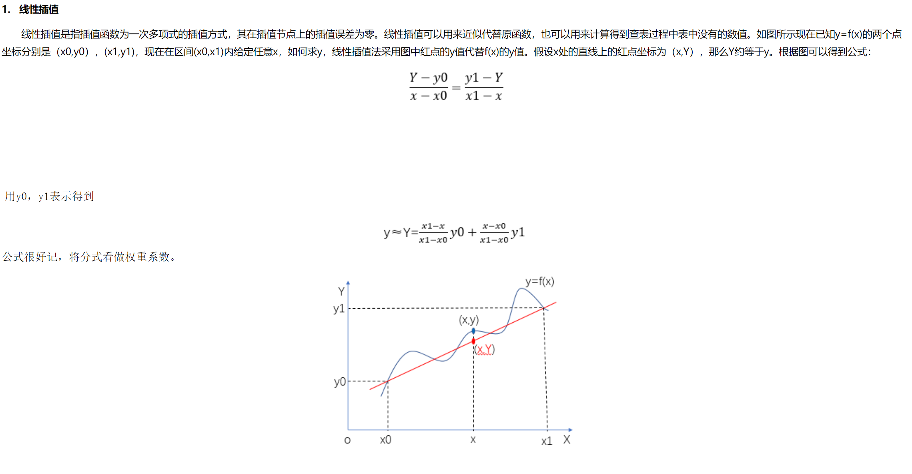
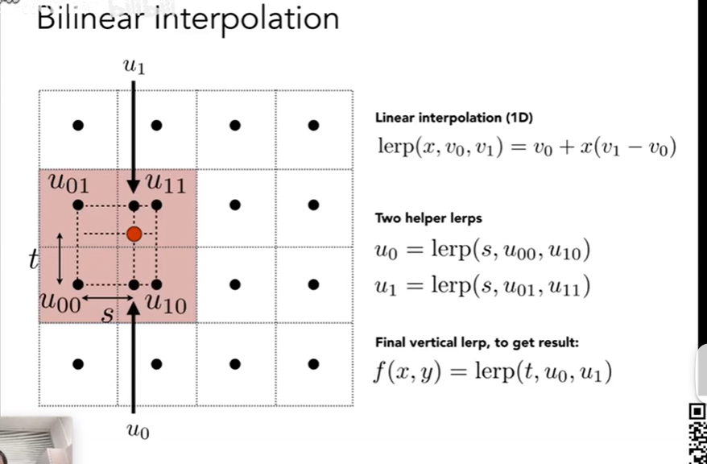

## 插值算法
用于干啥，缩小图片，扩大图片

线性插值
横向做一次线性计算，计算
通过比例计算，也就是权重系数

双线性插值法
找最近的4个点
横纵各计算一次线性插值技术 
距离作为权重

https://zhuanlan.zhihu.com/p/110754637

水平上下两趟 线性插值，然后得到了u1和u0在做一次竖行的插值，即就是线性插值

bilinear就是最紧的四个点
bicubic是最近的16个点

16个的效果会比较好，但是好的质量通常伴随着巨大的开销