导数：  
意义是为了 衡量变化率， 可以查看，每一个函数点的斜率，如果这个函数点做切线，如果切线的斜率变大，那么这个函数的斜率也是逐渐变大的

斜率就是两点的纵横坐标之比
导数的定义公式
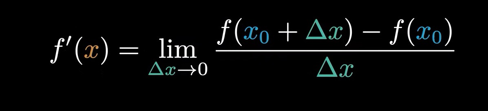

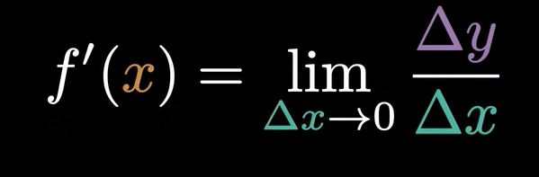
可以这样理解，导数就是在函数某处切线的斜率
delta y 和delta x 无限趋近于0的时候，相当这个点的斜率

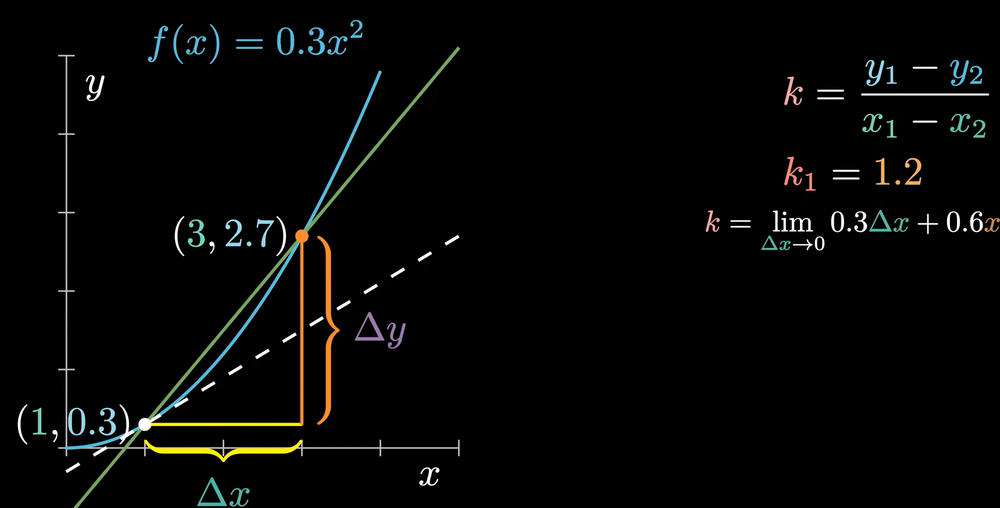
微积分：  
微分就是将图形分成很小很小的一份 dy -》0 增量

积分是离散数据求和，微分主要看是变化率
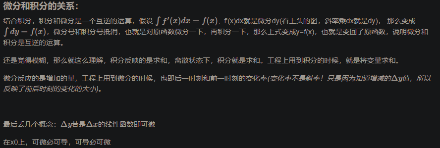

积分：设F(x)为函数f(x)的一个原函数，我们把函数f(x)的所有原函数F(x)+C（C为任意常数），叫做函数f(x)的不定积分，数学表达式为：若f'(x)=g(x)，则有∫g(x)dx=f(x)+c。

简单解释就是微分相当于求导，积分相当于求原函数
定积分相当于求面积
不定积分相当于求原函数

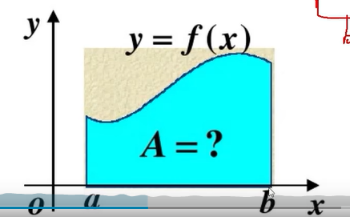  
 
怎么求曲面面积  
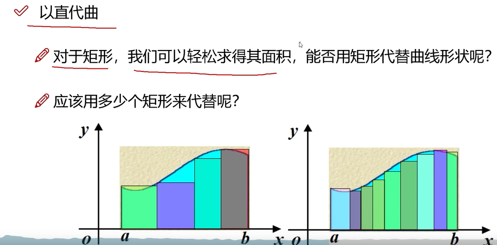
无限分下去
当样本量无限趋近于无穷大时，样本统计值无限趋近于总体参数。   

每一个样本点间距已知，然后f(x)也是已知的，就可以获取到样本矩阵的大小
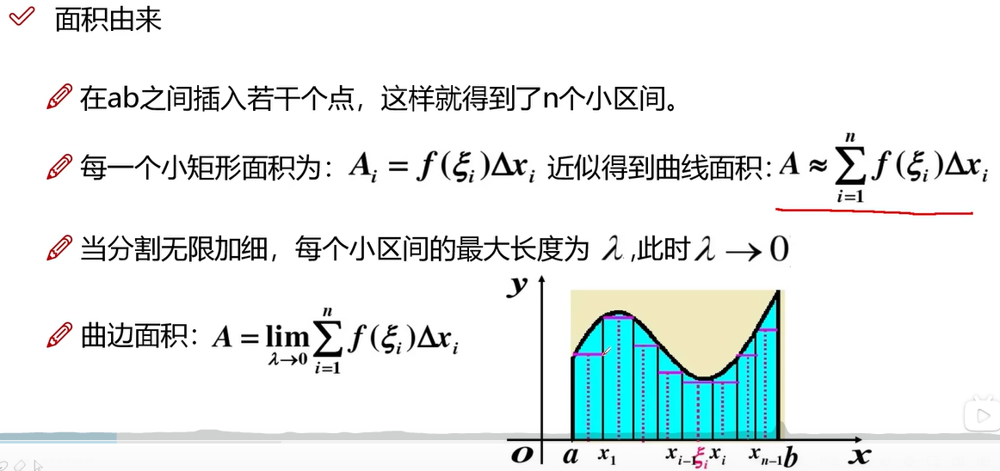  

目的就是求和，求矩形面积加上的之和，主要思想，底边摇足够的小
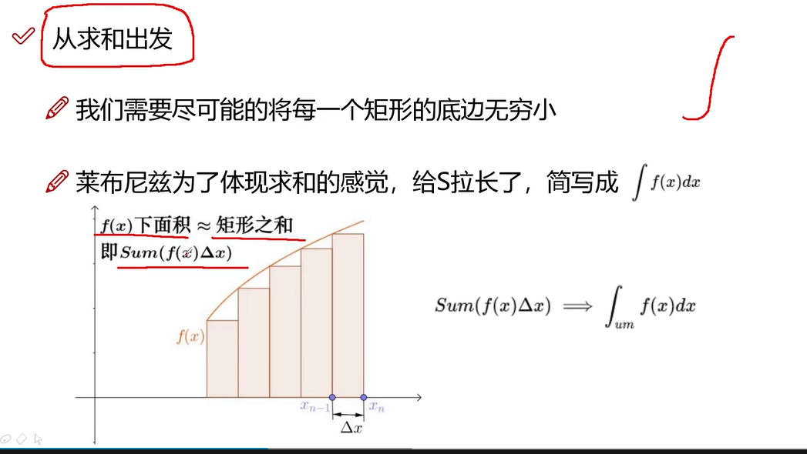

切线是什么  dy/dx 在无穷小的概念下面，就是变化率，也就是该点的斜率  
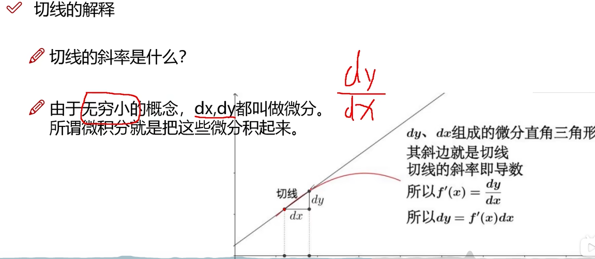  

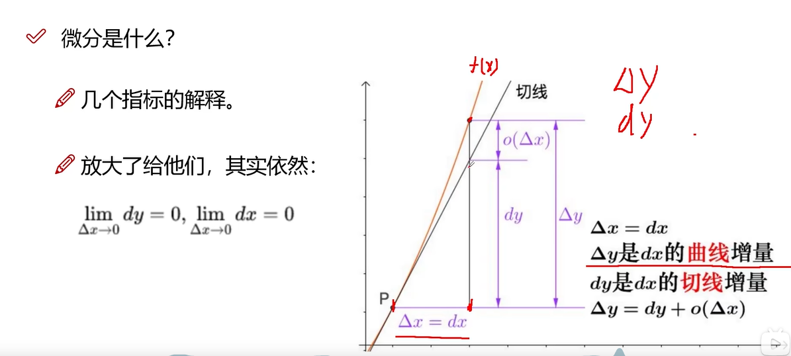

定积分  
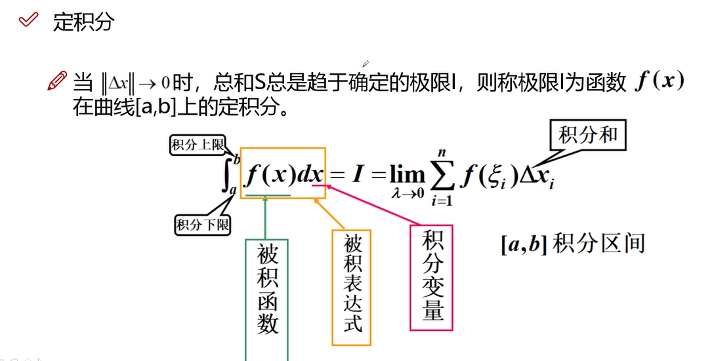

例题： 
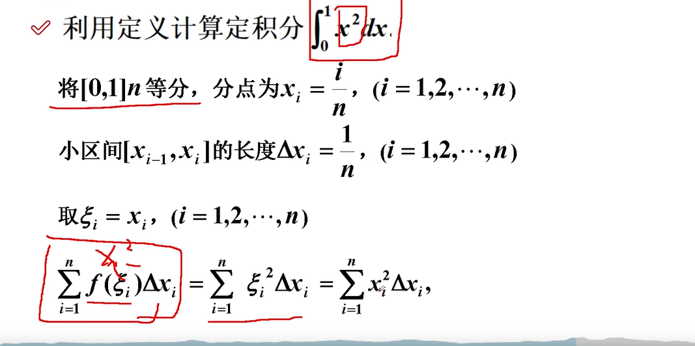

公式
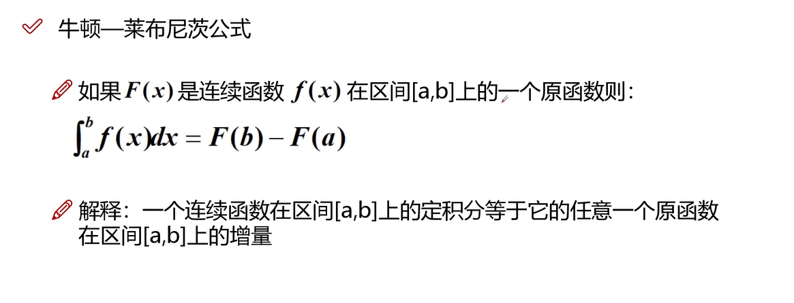

相当于就是 a到b之间的面积 为 0到b的面积减去0-a的面积

dy/dx 为fx的导数    每一个点的导数

这个是重点，将导数 和积分概念整成有一块
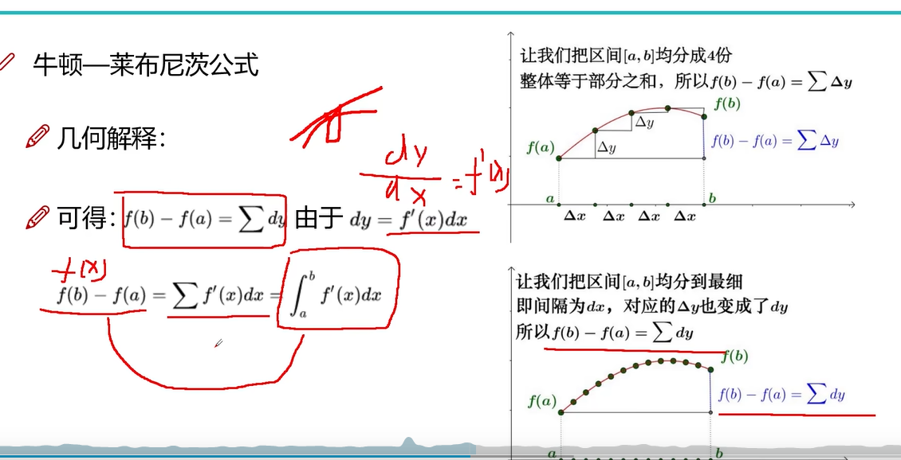