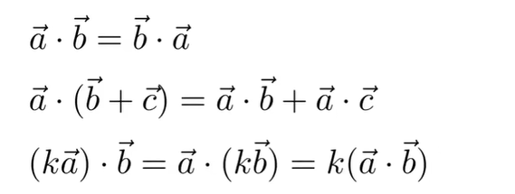
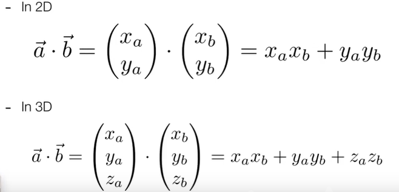
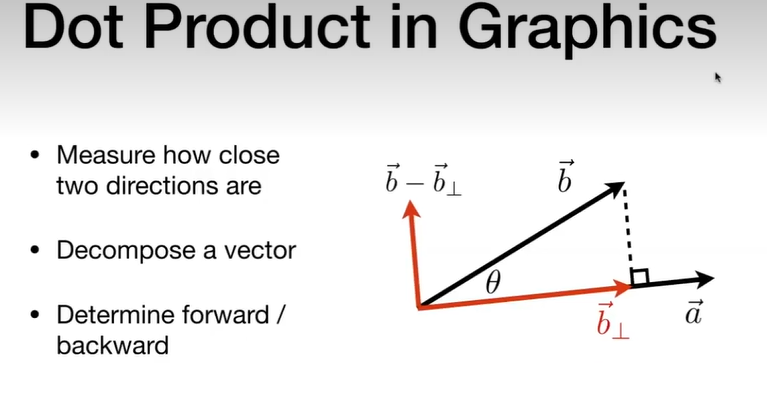

### 向量
1、模大小和方向一样，不管起始位置，这样的向量是等价
2、单位向量长度为1，一个向量除以他的长度就得到单位向量
3、默认是列向量从上往下乘 ,可以所有的矩阵都可以进行一个左乘

#### 向量的点乘和叉乘
点乘(得到是一个数)
$\vec{a} * \vec{b}$ = $|a||b|cos\theta$   
$cos\theta$ = $\vec{a} * \vec{b}$/$|a||b|$
点乘可以快速得到两个向量之间的夹角
且满足交换律结合律分配律

可以任意将一个向量分解为垂直和平行两个向量

点乘可以通过结果判断前和后，结果是否是正数

叉乘
opengl 是右手定则，directx是左手定则     
$|a×b| = |a||b|sin\theta$  右手旋转定则，四指从a转到b然后大拇指的方向
作用：建立一个三维空间的的一个直角坐标系

判断上下左右关系
### 矩形
矩形不满足交换律