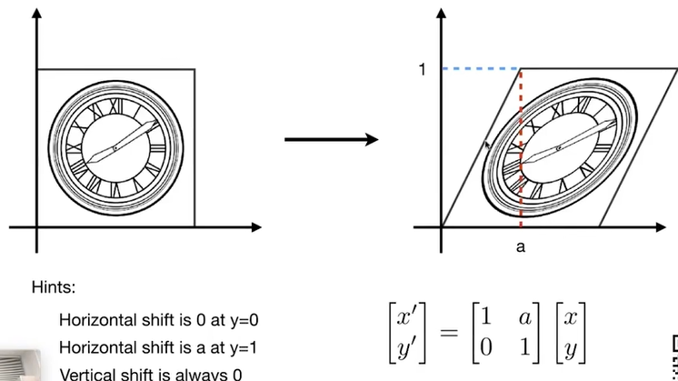

## 模型变化和视图变换

### 切变：
找出变化之前和变化之后图形，两者之间的关系即可算出具体的变化公式
水平上x都移动了 a*y 所以会有这种shear形状

### 旋转
推导：
因为任意两个点都得满足这个旋转矩阵，那么抓（0，1）和 （1，0）这两个点，然后待定系数法，带入矩阵即可算法旋转矩阵

### 齐次坐标
(服务于平移变化)
(引入的代价，任意一个点都变成xy1任何一个向量都是xy0)
平移他变不了一个矩阵乘以一个向量,所以平移就不是一个线性变化了，所以要升维度

对于这种变换叫做affine transformation 仿射变换

若要像上面那样，只要在小二维矩阵复现即可，平移更改w的3行行列即可。
最后一行是 0000 1 ，最后一列是要偏移的值

最后一条，两个其次坐标点相加，会得到一个2维平面的中点，应该x\w y\w,然后两个三维点的w是2w，那么最后变成x+x1\2w y1+y2\2w 就是中点的计算公式

变换

逆变化 就是把变换矩阵 逆回来即可
(矩阵乘以逆矩阵为单位矩阵)

矩阵不满足交换律，所以变换的顺序很重要
向量默认是列向量，变换矩阵默认是左乘，向量左乘矩阵

先线性变换在进行平移
