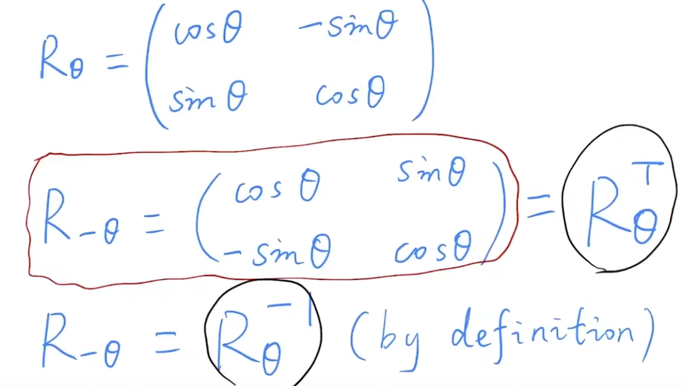

### 逆矩阵
逆矩阵，相当于回退操作，在旋转里面，旋转矩阵的逆相当旋转矩阵的转置

在数学里面一个矩阵的逆刚好等于他的转置，这个矩阵叫做正交矩阵

### MVP
model view project 
过程类似拍照 图形学就是这样的   
1、摆好pose model transformation   
2、找好相机角度   
3、投射 chees 拍摄   

### view transformation 试图变换
可能一开始相机的角度就是有所偏差的，然后我们知道他当前当前的状态，然后我们知道把他，从齐次坐标系变到当前状态的变换矩阵，求个逆矩克即可，将当前的相机归位到正坐标系上。利用旋转矩阵是正交矩阵，逆为转置
### 3D transformaion
#### rotation
绕着哪一行旋转，那一行列就不变
发现绕着y轴的这个，这个右上角和左下角的符号跟其他两个有出入，这是因为叉乘的时候，得x叉乘z才能得到y（通过右手定则）所以多了一个负号(正常都是xyz这个顺序下去叉乘的,所以会有这种出入)

#### 旋转公式

### 投影变换 project transformation
#### 正交投影 orthographic projection (不会带来近大远小的现象)

往z-向下看，这时候把z轴给拿到，得到的也是一张xy平面图
#### 透视投影 perspective projection （更倾向与人实际看到的东西，平行线会相交感觉）
(这个好像是要把梯形体，变成一个长方体，然后far plane是要往内挤的，变成和前面的平面一个的图形)

从透视到正交(通过相似三角形计算求得)

相似三角形z不变

（！！！ 为什么z要未知呢，主要是让他算出，点的远近关系，然后利用两个远近平面中心点不变的原理，计算出投射矩阵z的关系，得出z）

就是一个点，经过透视矩阵变化，被挤压成这个向量坐标
所以得出透视变换矩阵大概是这种样子 ,xy 是这样变化的

第三行z的变换 参数填入（取一个特殊点，就是中心点，不管怎么挤压，他都是00f的中心点） z在近和远的平面上不变，利用这两个条件计算，那么对于中间的平面 z是怎么变化的

近平面的z的精度和远平面的精度，不是按照平面距离线性变化的，近距离的平面精度更大，这样什么好处呢，那么这样就近距离的他就不会闪烁，因为，远距离，精度不大，导致z不知道谁要在谁上面，就是随机，也就是会闪烁(下述所说的冲突)

这种视觉伪像是由于浮点计算的舍入误差导致，可以通过减少远近平面的距离实现

透视转换矩阵出来后，就可以转为正视矩阵查看

透视矩阵后，范围会在-1，1 三次方经典的立方体里面

B站继续解析
矩阵变化是矩阵相乘，包含着矩阵元素相乘相加的步骤，但是通过相似三角形比例计算，发现有除法，所以利用其次坐标系搞定division

透视投影会将图像压在-1 1之间
z轴就是来判定谁在前面谁在后面的作用
ndc 标准化设备坐标

解疑问：
只要通过实例 fn 计算带入即可更加清楚关系

疑问：远平面 投射在近平面应该显示的是二维的吧
比较理解不了的，应该是z坐标在平面的显示吧