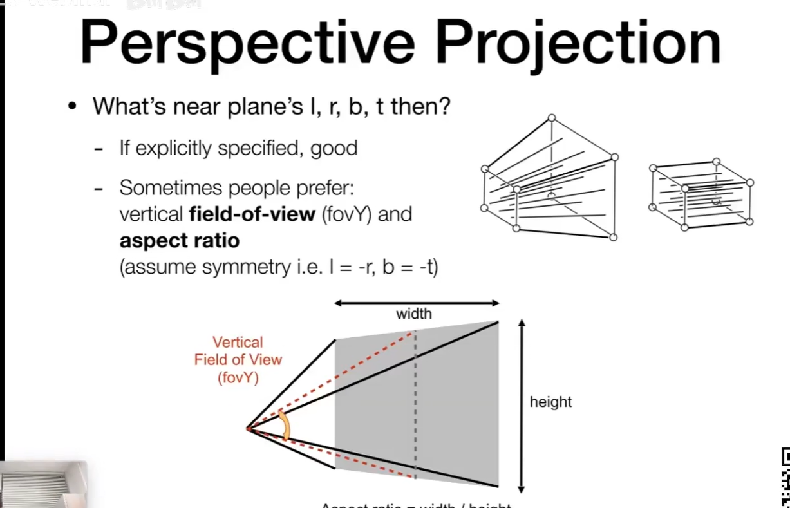
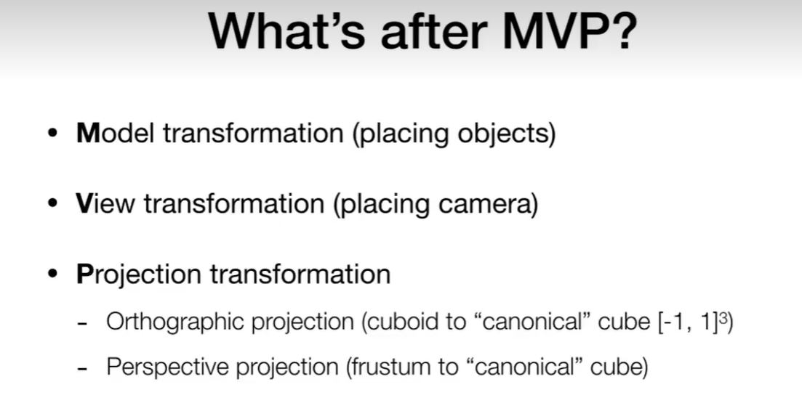
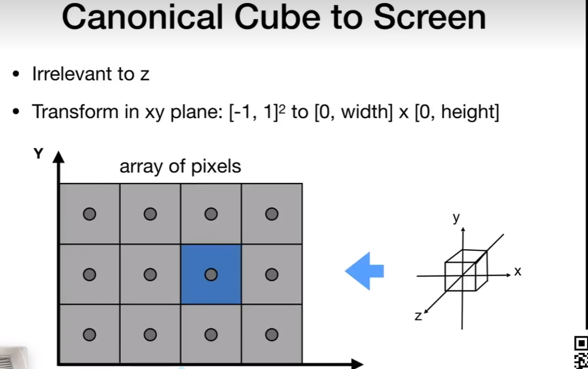
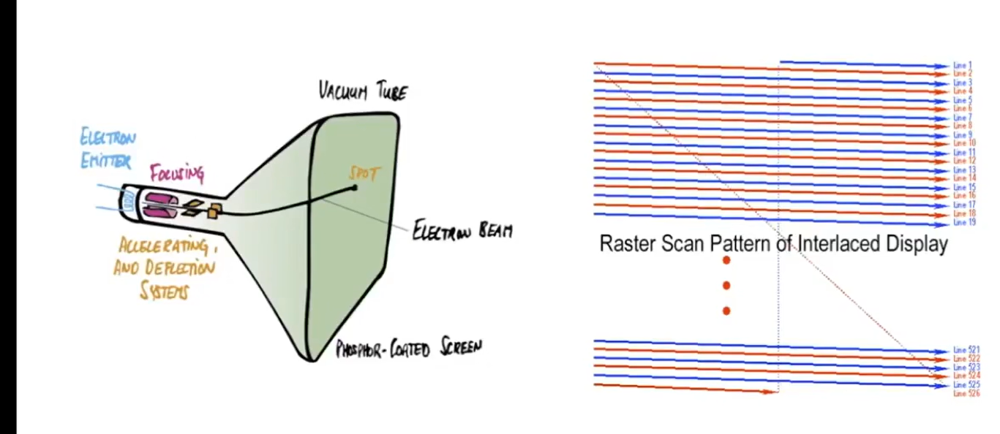
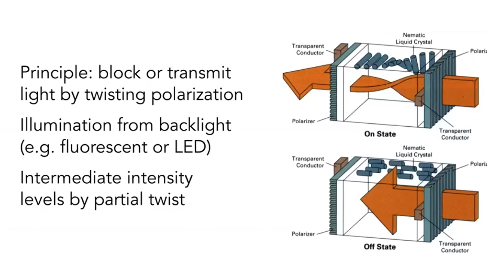
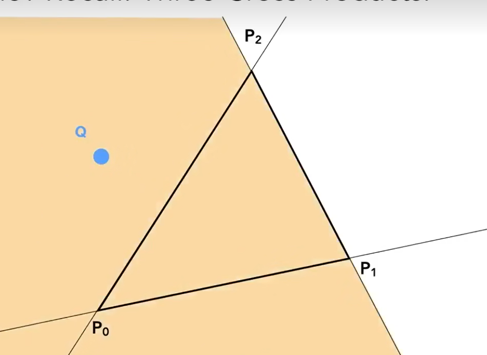
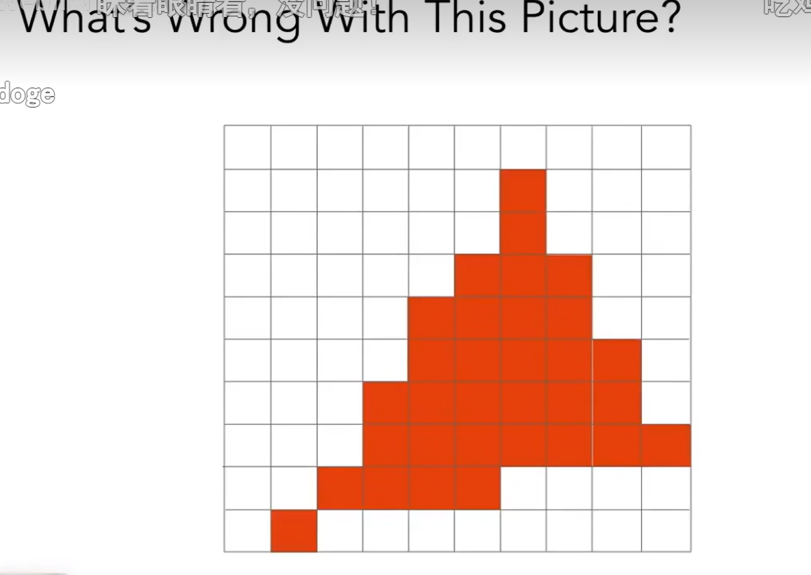
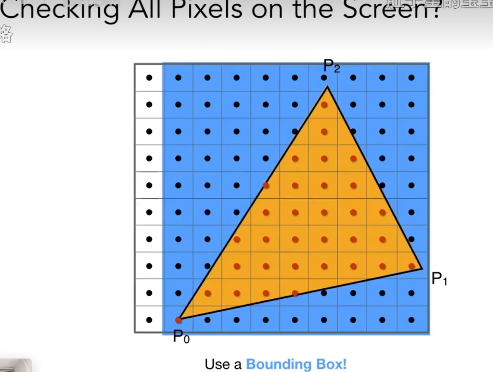

## fov 视野范围

## 三种转换矩阵之后

## 屏幕的定义
1、二维的像素点组合
2、分辨率
3、光栅呈现设置
## 光栅化 raster（屏幕 德语）
那么意思就很明了了，就是drawing onto the screen
## 像素
一个像素就是一个小方块，一个小方块就是一种颜色 抽象理解（严禁来说是不对）
## 视口变换 viewport transformation 重点 等会看一下
视觉窗口的改变
转化为屏幕坐标 ,把 -1 1之间 变换为屏幕空间
做的是缩放，平移的操作 ,这样应该也是显示在屏幕的区域空间了  
就是把原本中心点，移到左下角，往右往上移动 二分一的宽高，然后每个点乘上比例

## 光栅显示设备
1、示波器  早期的电脑屏幕是这样 ，一个个电子打过来显示，通过屏幕扫描方法，光栅扫描（隔行扫描，通过人眼的存留的时间的机制，但是对于高速运动，会有鬼影的效果，不过这个方法目前有用于视频压缩啥的）

2、lcd 液晶显示  光的偏振
 
 led 发光二极管 点阵
3、手机 平面 高分辨率设置 

## 三角形最基本的形状基础
### 判断一个像素的中心点和三角形之间的关系
通过叉积

三个向量叉乘 向量q  要么全正要么全负的，才能表明q在三角形里面 
包围盒，取每一个点的最大 和最小形成的一个盒子（蓝色区域）这样就不用整个区域取做处理了
通过叉积把所有的点给圈出来以后，就是发现有锯齿 jaggies (alising)，原因呢，就是像素有一定的大小，采样率，新高是不够高的，产生走样的

### 采样 
采样相当将一个函数给离散化的过程，离散化是什么

