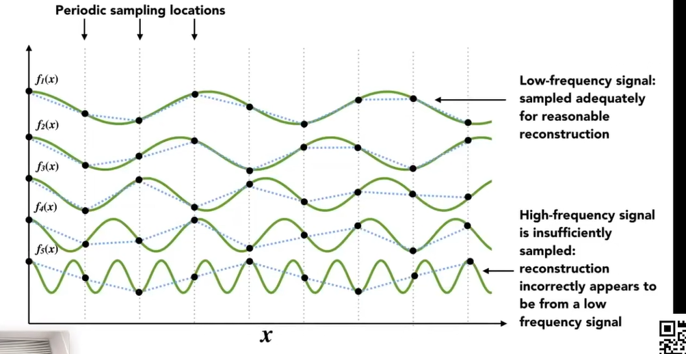
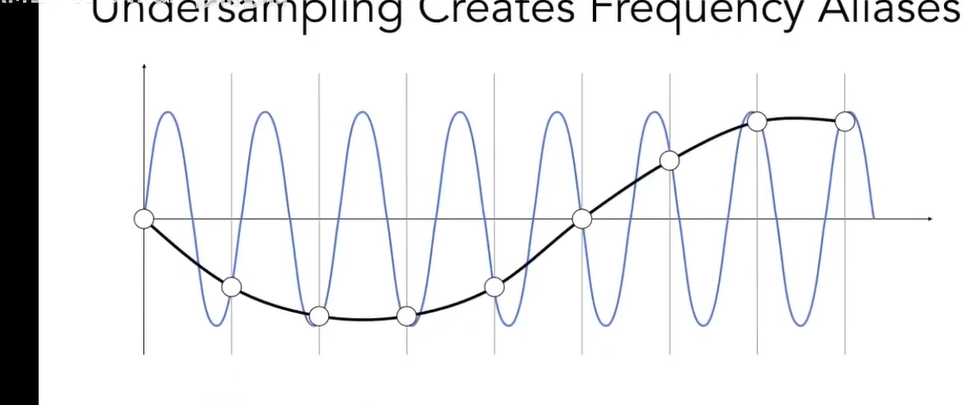

通过中心点采样会有锯齿

### 锯齿（学名叫走样 aliasing）

### 采样 以及采样的artifact（类似瑕疵）

artifact 的原因

#### 反走样
先对图形进行模糊，在进行采样（低通滤波）

#### 人眼也是有采样的，电风扇啥的，就是人眼采样顺序跟不上电风扇的旋转速度就是会感觉有时候在倒转或者停止

### 走样的原因
采样的速度跟不上变化的频率就是走样

在采样率一致的情况下，可以看出变化频率比较低的f1，可以恢复出比较好的原来的图像，变化频率比较高的f5 采样效果就比较差

（采样率是频率的两倍以上）

以下面那张图为例子，就是两个图形的采样结果都是黑色的曲线，我们无法区分他们是的采样，这时候叫走样

滤波删除某些特定的频段叫滤波