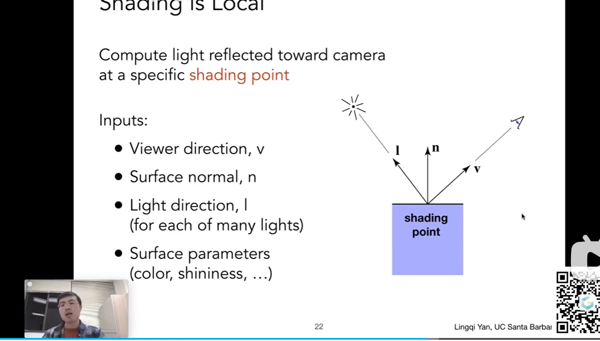

渲染-油画家算法
远处先画，然后将近慢慢覆盖上去即可

深度缓存zbuffer （每一帧开始绘制的时候都要重新计算z-buffer 和deeptbuffer这个就是考验显存的访问速度

透明物体处理不了zbuffer ，要特殊处理

着色
对一种物体使用不同材料处理
冯氏高光模型

变化不是那么明显的高光反反射 称为漫反射 diffuse reflection
specular 镜
ambient 周围

着色：

着手并不考虑阴影

阴影得深度图加z缓冲