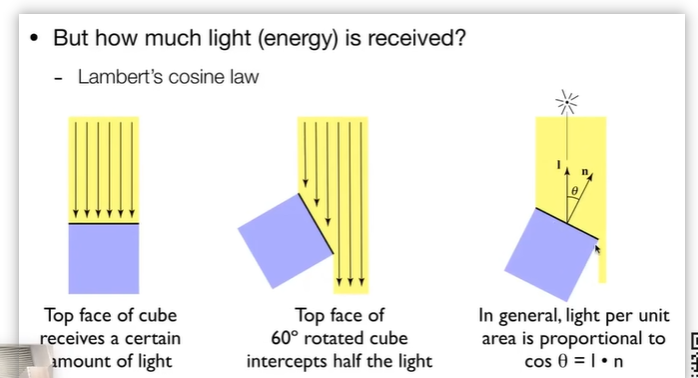

渲染-油画家算法
远处先画，然后将近慢慢覆盖上去即可

深度缓存zbuffer （每一帧开始绘制的时候都要重新计算z-buffer 和deeptbuffer这个就是考验显存的访问速度

透明物体处理不了zbuffer ，要特殊处理

着色
对一种物体使用不同材料处理
冯氏高光模型

变化不是那么明显的高光反反射 称为漫反射 diffuse reflection
specular 镜
ambient 周围

着色：
Blinn-Phong 着色模型

着手并不考虑阴影
阴影得深度图加z缓冲

光线到表面的，该物体就是接受到多少能量，旋转夹角不一样，能量就不同，所以显示的明暗就有所不同

单位面积接收到的能量 lambert's consine law 光线的余弦，当面与直线垂直，就是cos90° 就是0，接受到的能量就是为0

单位上的能量与光源射入的角度有关，与观察的角度无关，所以一个漫反射在各个位置上观看，其实亮度是一样的

入射方向，多少能量到达那里，多少能量被吸收，算出多少能量被反射，漫反射系数可以说明

