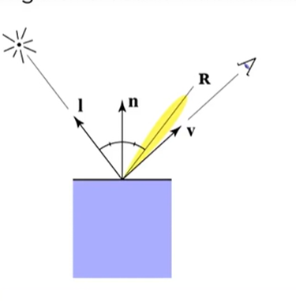
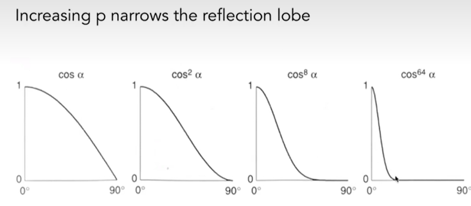
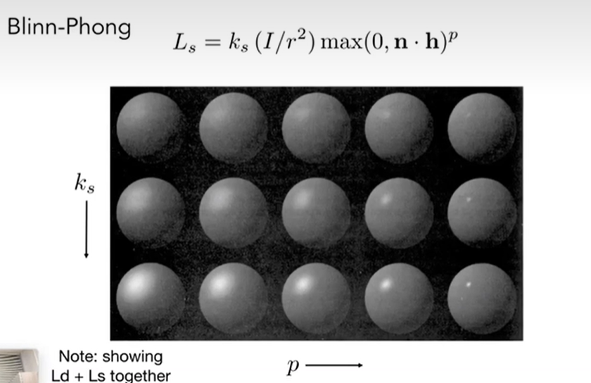
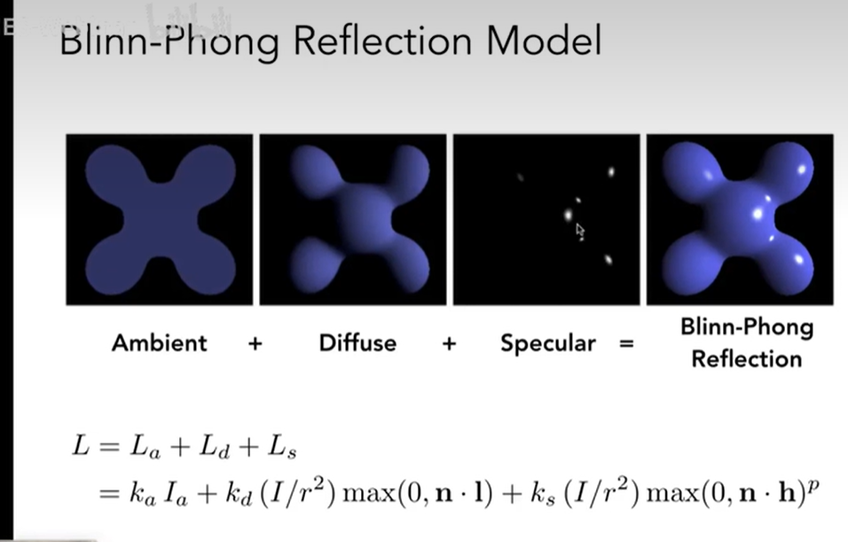
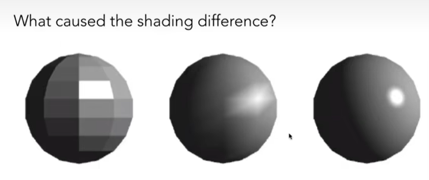
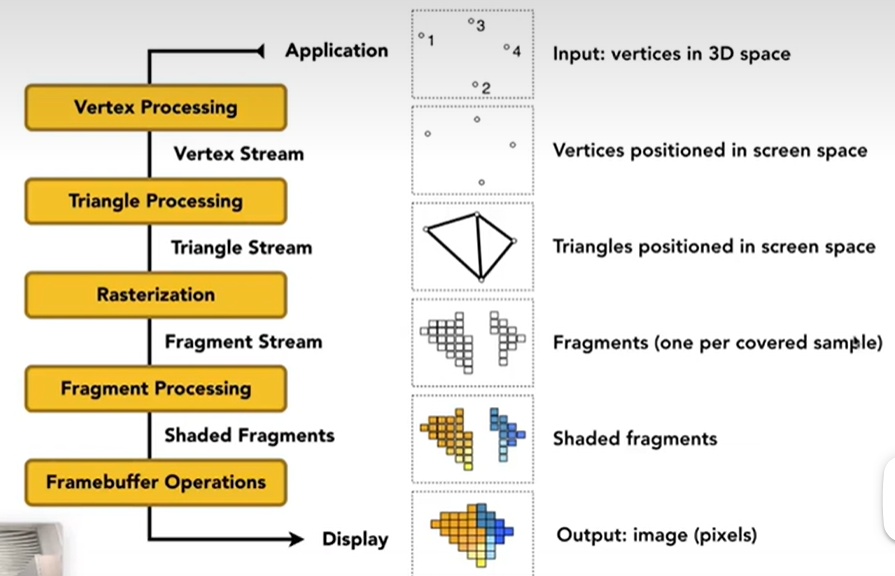
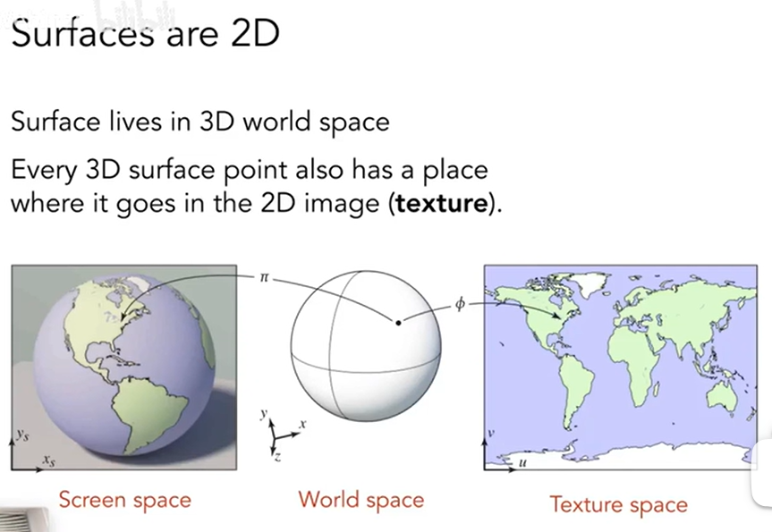
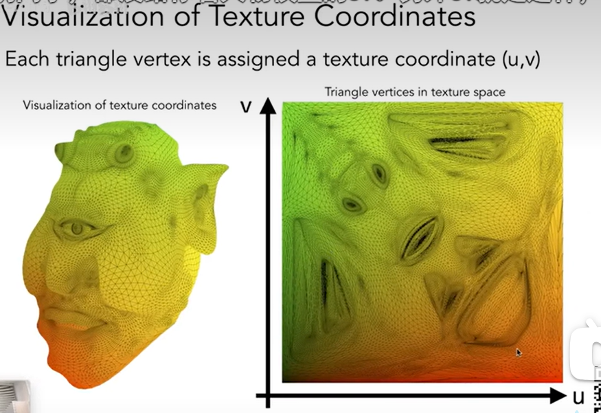
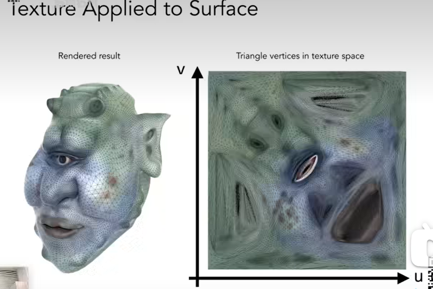

问题：
1、插值是什么
2、加权是什么

shadertoy 网站 就是着色器的东西 

漫反射出来的亮度都是一致的，跟观测的角度无关系，不过当观测角度与镜像反射差不多的时候，就是可以观测高光

半程向量（Blinn-phong光照）
https://learnopengl-cn.github.io/05%20Advanced%20Lighting/01%20Advanced%20Lighting/

就是视线角度与光线角度一半，用向量平行四边形法则，就可以得出半程向量，当半程向量与法向量越接近的时候，视线察觉高光的时刻越接近。
怎么判断呢 用点乘
计算角度嘛
v+l/||v+l|| 就为cos角度，当越接近1的时候，代表两个越接近（好算）

平方数就是代表 cos对变化容忍太高了，就是变化很平滑，不能体现出，这点就是高光点，然后稍微偏移一下，就不是高光点了

在Blinn-phong里面 这个指数通常会被用到100-200，转瞬即逝的效果

k就是亮度，越大越亮没什么好说的，p的就是高光，越大代表转瞬即逝

Ambient Term 环境光照 相当于自发光

自发光（环境光）+ 漫反射 + 高光项就可以得到我们看到的物体，也就是blinn-phong 模型 

radiance 辐射 实际意义上的能量

shading frequencies 辐射频率

phong shading 每个像素做着色 
目前有三个模型：
1、一个是按照面来的着色。
2、一个是按照顶点来着色
3、bp模型就是按照每个像素来着色
当比较小的时候，按照像素效果比较好一点。
不过在现在，大渲染的情况下面，按照效果不一定比按照像素的差，像像素的也不一定计算量就比按面的多。

实时渲染管线：

就是opengl的渲染流程

fragment 就是片段着色，通过反走样的知识，知道每个点都要绘制上怎么样的一个点。

顶点着色器和片段着色器
就是每个像素在里面都这么做，所以不用使用for循环
3D的表面也是球体

纹理坐标 uv
u 和v 都是0-1 之内 约定俗成的东西

每一个三角形的顶点都是对应着一个uv
这个就是纹理映射

表面皮肤

纹理和着色的区别：
着色定义的时候往往每一个点都做着同样的着色，但是图案可以轻松对每一个点进行颜色控制
就是每一个顶点，我不希望他以相同的方式进行着色，纹理可以给一个顶点额外的着色信息，改变一些逐点属性

着色和材质：
就是不同的材质等于不同的着色

