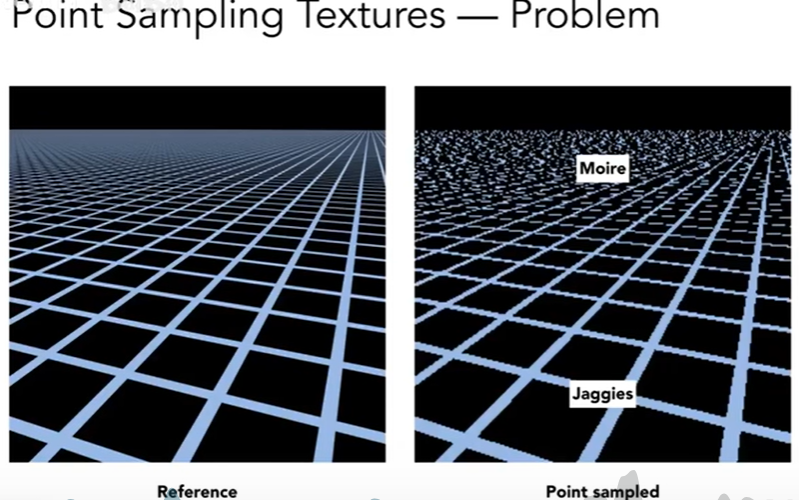
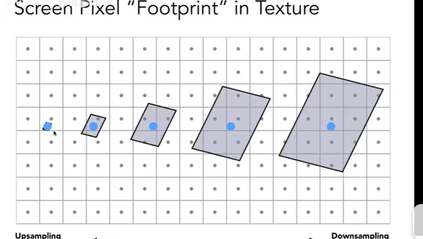
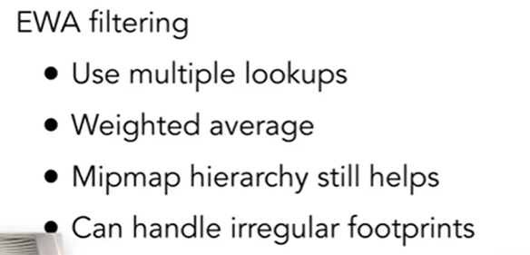
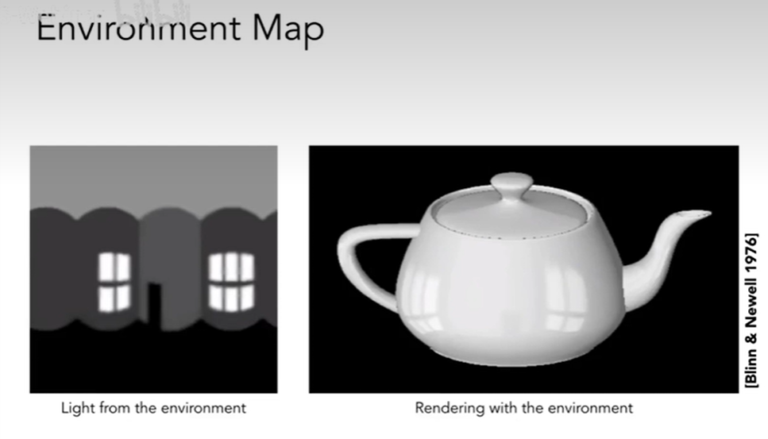
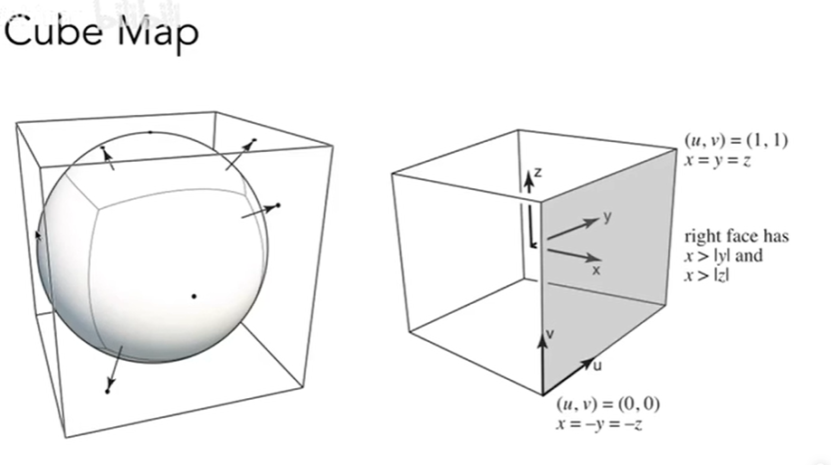
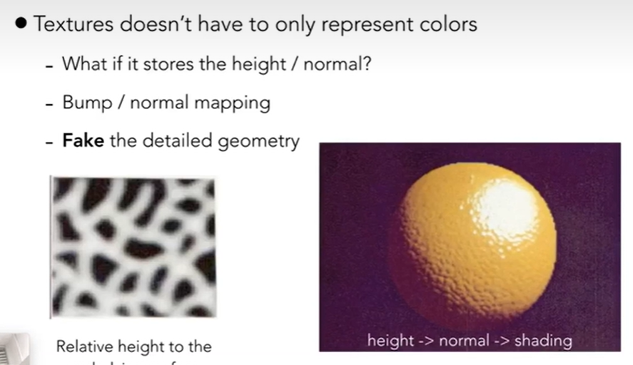
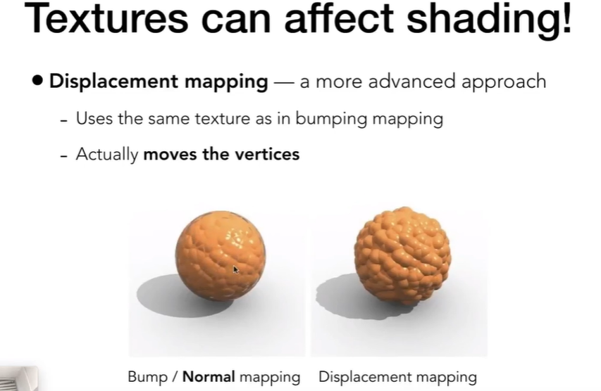

顶点就是顶点着色器，像素就是片段着色器
纹理就是三维空间中，填上一张二维图片

### 三角形的重心插值

问题：三角形中任意一个点，怎么知道着色值?

之前说过，知道纹理映射到三角形顶点的哪些位置，但是不知道映射到三角形内部的哪些位置，所以需要重心插值
重心坐标和三角形重心不是同一个东西
四点共面的方法

摩尔纹是什么
### 纹理大小
纹理太小，被拉大利用插值的方法去实现，可能就会有锯齿采样率比较低
纹理太大，会产生摩尔纹 远处，锯齿 近处
也就是走样问题 信号变化过快，采样跟不上他就会走样

原因：
近处，一个像素覆盖的纹理比较少，远处一个像素覆盖的纹理比较多

解决方案：
采样会引发走样，那我们不采样呢

范围查询
点查询：
双线性插值就是点查询
纹理上面的区域

### mipMap 多层查询
比较近的就是低层查询，比较远的就是得高层查询

过渡的怎么处理
像1层向2层过度的时候中，如果有1.8层怎么处理？
答：插值法  三线性插值 ，为了连续  开销的话就是两次查询一次插值，开销比较小（在游戏中都是三线性插值)

mipmap 的限制
在远处 就没了
overblur 过度的模糊

 
各向异性过滤 (ripmap)可以部分解决过度模糊
部分是指 矩阵的方块，但是斜的不行

改进方案
EWA 过滤
// 多次查询
资源消耗是原来的三倍
mipmap是多了三分一

### 纹理还有什么其他的应用
纹理在计算机里面相当于一块内存，我们对这个内存进行一个查询或者滤波过滤，一块区域可以点查询或者范围查询，数据，没必要限制在一块图像上
1、环境光照

天空盒 skybox

2、凹凸贴图

凹凸贴图和法线贴图是一回事，都是通过纹理来决定而不是几何形体
法线上的变化，导致敏感度的变化，在不对纹理坐标进行处理，使用复杂的纹理，可以做到凹凸

凹凸贴图是假的，给人眼睛一种感觉，第二种是真的对顶点 几何修改，投影会有明显的不同（位移贴图）
