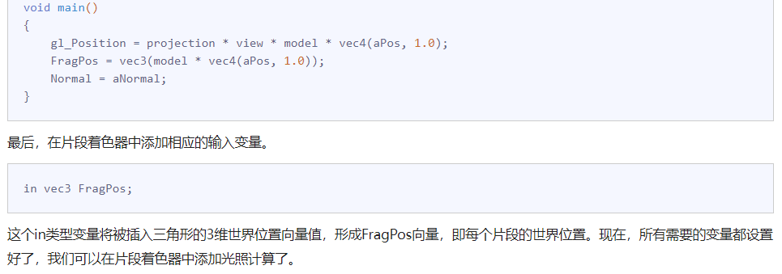

- [向量与vec3关系](#向量与vec3关系)
- [向量乘法](#向量乘法)
  - [向量点乘](#向量点乘)
    - [矩阵乘法](#矩阵乘法)
    - [使用 C++ 和 GLM 库的示例](#使用-c-和-glm-库的示例)
    - [代码解析](#代码解析)
- [光照](#光照)
  - [颜色](#颜色)
    - [一个着色器的生命周期](#一个着色器的生命周期)
    - [光照颜色](#光照颜色)
    - [phong 模型](#phong-模型)
      - [环境光照](#环境光照)
      - [漫反射光照](#漫反射光照)
        - [计算漫反射光照：(有疑问的点)](#计算漫反射光照有疑问的点)
      - [镜面光照](#镜面光照)
        - [原理：](#原理)
  - [材质](#材质)
  - [光照贴图](#光照贴图)
    - [漫反射贴图](#漫反射贴图)
    - [镜像反射的贴图](#镜像反射的贴图)
      - [镜像反射，可将一张纹理倒射在 目标片段上面](#镜像反射可将一张纹理倒射在-目标片段上面)
      - [聚光不同 也会影响到光照因素](#聚光不同-也会影响到光照因素)
      - [只是贴张图上去，然后角度只是决定纹理哪个区域比较明亮](#只是贴张图上去然后角度只是决定纹理哪个区域比较明亮)
      - [散光大点，可以看点左上角比较亮点，显示的就是整张纹理贴在上面](#散光大点可以看点左上角比较亮点显示的就是整张纹理贴在上面)
      - [黑色其实还是有影响到的](#黑色其实还是有影响到的)
  - [投光物](#投光物)
    - [平行光](#平行光)
    - [点光源](#点光源)
      - [衰减(attenuation)](#衰减attenuation)

# 向量与vec3关系


# 向量乘法

把向量点乘转化 转置乘向量，转化为矩阵乘法。 两个结果相等
## 向量点乘
给定两个 \( n \) 维向量 \(\mathbf{a}\) 和 \(\mathbf{b}\)，它们的点积定义为：
\[ 
\mathbf{a} \cdot \mathbf{b} = a_1 b_1 + a_2 b_2 + \cdots + a_n b_n
\]
例如，对于两个三维向量 \(\mathbf{a} = (a_1, a_2, a_3)\) 和 \(\mathbf{b} = (b_1, b_2, b_3)\)，点积为：
\[ 
\mathbf{a} \cdot \mathbf{b} = a_1 b_1 + a_2 b_2 + a_3 b_3 
\]
### 矩阵乘法
矩阵乘法则是更广义的运算。如果我们有一个行向量 \(\mathbf{a}\) 和一个列向量 \(\mathbf{b}\)，它们的乘法可以视为矩阵与向量的乘法。在这种情况下，点积实际上就是矩阵乘法的一种特例。
例如，考虑一个 \(1 	imes n\) 的行向量 \(\mathbf{a}\) 和一个 \(n 	imes 1\) 的列向量 \(\mathbf{b}\)，它们的乘积是一个标量：
\[ 
\mathbf{a} = \begin{pmatrix}
a_1 & a_2 & \cdots & a_n
\end{pmatrix}
\]
\[ 
\mathbf{b} = \begin{pmatrix}
b_1 \\ b_2 \\ \vdots \\ b_n
\end{pmatrix}
\]
\[ 
\mathbf{a} \mathbf{b} = \begin{pmatrix}
a_1 & a_2 & \cdots & a_n
\end{pmatrix}
\begin{pmatrix}
b_1 \\ b_2 \\ \vdots \\ b_n
\end{pmatrix}
= a_1 b_1 + a_2 b_2 + \cdots + a_n b_n
\]
这实际上就是\(\mathbf{a} \cdot \mathbf{b}\)，即这两个向量的点积。
### 使用 C++ 和 GLM 库的示例
为了更好地理解这一点，可以使用GLM库在C++中实现上述运算。
```cpp
#include <glm/glm.hpp>
#include <iostream>
int main() {
    // 定义两个三维向量
    glm::vec3 a(1.0f, 2.0f, 3.0f);
    glm::vec3 b(4.0f, 5.0f, 6.0f);
    // 计算点积
    float dotProduct = glm::dot(a, b);
    std::cout << "Dot product: " << dotProduct << std::endl;
    // 定义一个 1x3 行向量和一个 3x1 列向量
    glm::mat1x3 rowVec(a.x, a.y, a.z);
    glm::mat3x1 colVec(b.x, b.y, b.z);
    // 使用矩阵乘法计算点积
    glm::mat1x1 matProduct = rowVec * colVec;
    std::cout << "Matrix product (dot product): " << matProduct[0][0] << std::endl;
    return 0;
}
```
### 代码解析
1. **定义两个三维向量**：
    ```cpp
    glm::vec3 a(1.0f, 2.0f, 3.0f);
    glm::vec3 b(4.0f, 5.0f, 6.0f);
    ```
2. **计算点积**：
    ```cpp
    float dotProduct = glm::dot(a, b);
    std::cout << "Dot product: " << dotProduct << std::endl;
    ```
3. **定义矩阵表示的行向量和列向量**：
    ```cpp
    glm::mat1x3 rowVec(a.x, a.y, a.z);
    glm::mat3x1 colVec(b.x, b.y, b.z);
    ```
4. **使用矩阵乘法计算点积**：
    ```cpp
    glm::mat1x1 matProduct = rowVec * colVec;
    std::cout << "Matrix product (dot product): " << matProduct[0][0] << std::endl;
    ```
总结
- 点积可以看作是行向量和列向量之间的一种特殊的矩阵乘法。
- 矩阵乘法是更广义的运算，可以处理任意形状的矩阵，而点积是矩阵乘法的一种特例，只处理特定形式的向量。
- 利用GLM库，可以方便地在C++中进行向量和矩阵运算，从而验证理论上的数学运算。


# 光照
## 颜色
### 一个着色器的生命周期
因为里面调用函数都直接拿gpu里面的数据，当有多个着色器的时候，怎么分别资源管理的呢

想必使用的时候，就用这个进行切换的吧

回答:
``` 
glUseProgram 是不是把当前gpu资源切换成当前的着色器program，然后就可以调用不同着色器内部的参数
是的，`glUseProgram` 函数在OpenGL中确实起到了切换当前使用的着色器程序的作用。当你调用 `glUseProgram` 时，它会将指定的着色器程序设为当前活动的程序。从该调用开始，到下一个调用 `glUseProgram` 之前，所有的渲染调用将使用这个着色器程序。
一旦一个着色器程序被设置为当前活动程序，你就可以使用 OpenGL 提供的函数来设置这个程序中的uniform变量等参数。这包括但不限于：
- `glUniform1f`, `glUniform2f`, `glUniform3f`, `glUniform4f` 等，用于设置浮点类型的uniform变量。
- `glUniform1i`, `glUniform2i`, `glUniform3i`, `glUniform4i` 等，用于设置整数类型的uniform变量。
- `glUniformMatrix2fv`, `glUniformMatrix3fv`, `glUniformMatrix4fv` 等，用于设置矩阵类型的uniform变量。
- `glBindAttribLocation` 和 `glGetAttribLocation` 用于设置和获取attribute的位置。
```

### 光照颜色
也就是 光照的，乘以当前物体的颜色，就是混合起来，并且作用于当前的物体就是结果色，但是后续应该还要考虑距离的问题
```
glm::vec3 lightColor(1.0f, 1.0f, 1.0f);
glm::vec3 toyColor(1.0f, 0.5f, 0.31f);
glm::vec3 result = lightColor * toyColor; // = (1.0f, 0.5f, 0.31f);
```

### phong 模型
phong 模型 包括环境光照，漫反射光照，镜面光照
#### 环境光照
Ambient Lighting)：即使在黑暗的情况下，世界上通常也仍然有一些光亮（月亮、远处的光），所以物体几乎永远不会是完全黑暗的。为了模拟这个，我们会使用一个环境光照常量，它永远会给物体一些颜色。
像代码里面直接就乘以一个外面的颜色值，就类似全局照明模型了。
（真正的全局照明算法 比较复杂 考虑到这种情况的算法叫做全局照明(Global Illumination)算法，但是这种算法既开销高昂又极其复杂。）

#### 漫反射光照
(Diffuse Lighting)：模拟光源对物体的方向性影响(Directional Impact)。它是风氏光照模型中视觉上最显著的分量。物体的某一部分越是正对着光源，它就会越亮


这个是入光的向量，和反射的向量呈现余弦值，所以两向量垂直的时候是没有光线的，两向量角度为0的时候，亮度最亮

漫反射的条件：1
```
计算漫反射光照需要什么？
法向量：一个垂直于顶点表面的向量。
定向的光线：作为光源的位置与片段的位置之间向量差的方向向量。为了计算这个光线，我们需要光的位置向量和片段的位置向量。
```

##### 计算漫反射光照：(有疑问的点)
正常来说，在片段着色器里面只要颜色或者纹理就行，为什么在计算漫反射光照的时候要在片段着色器里面计算 这个model的坐标然后乘上这个片段着色器呢


估计的原因就是根据法向量，然后决定着fragment 片段着色器的 显示的分量，就是光照的亮度，然后不同颜色估计得，向量相乘（不是点×乘）就是计算分量，然后得出具体显示的颜色


法线计算，它直接在输入顶点的时候就把简单的法向量，直接输入进去了。
然后跟随着模式矩阵 旋转 位移等操作。


在顶点着色器里面获取 模型矩阵进行计算，为了在片段着色器 配合着法向量计算 光线的偏角度


* 步骤
```
 外部要传入 光源的位置，然后以及颜色,然后计算向量角度

光源坐标，怎么来的，怎么兼容他的旋转 （目前就写死一个向量坐标）

光源向量，就是光线位置减去当前顶点坐标的位置，然后点乘该顶点的法向量，计算出光照分量，

光照分量在加上环境光照 ，在成该点的颜色值，即可得出该点的最终颜色

光线向量和法向量 越向90趋势，那么光照越弱 因为cos 90 等于0

如果不乘上环境光的话，那么cos 大于90哪些光线分量就是黑色的，环境光线给点 颜色值而已
```


没有环境光线就是漆黑的一片

有环境光分量就更亮点


法向量在 modelview矩阵改变的时候 发生不等比的scale时候，法向量，会变，等比时发现法向量可能长度有变但是方向不变，使用归一化能简单解决这个问题。

不等比scale要怎么处理呢


法向量不是跟切线一样代表着通过两个点进行计算,它是定义为 垂直的切线的，所以他不能通过两个点去乘上这个modelview矩阵计算法向量。


但是我们知道这个切线向量，是通过两个点去计算的，这两个点是受这个modelview矩阵影响，所以我们可以得到这个切线转换后的向量，然后通过垂直可以得出 切线向量和法向量点乘 为0 ，既可求出法向量。

emm 他们好像是用法线矩阵
使用一个矩阵来达到算出法向量的效果。
Consider a 3×3 matrix G, and lets see how this matrix could be computed to properly transform the normal vectors


// 法线矩阵被定义为法线矩阵被定义为「模型矩阵左上角3x3部分的逆矩阵的转置矩阵」 
```
推的话 在这里http://www.lighthouse3d.com/tutorials/glsl-12-tutorial/the-normal-matrix/
通过垂直点乘为0去计算得到矩阵。
结果是
Normal = mat3(transpose(inverse(model))) * aNormal;
```
注意点是：
gpu不太擅长难度大的操作。
矩阵求逆是一项对于着色器开销很大的运算，因为它必须在场景中的每一个顶点上进行，所以应该尽可能地避免在着色器中进行求逆运算。以学习为目的的话这样做还好，但是对于一个高效的应用来说，你最好先在CPU上计算出法线矩阵，再通过uniform把它传递给着色器（就像模型矩阵一样）。
在漫反射光照部分，光照表现并没有问题，这是因为我们没有对物体进行任何缩放操作，所以我们并不真的需要使用一个法线矩阵，而是仅以模型矩阵乘以法线就可以。但是如果你会进行不等比缩放，使用法线矩阵去乘以法向量就是必须的了。

正交矩阵 每一行每一列 每个数平均加起来为1 ,正交矩阵的逆 等于转置矩阵
#### 镜面光照
Specular Lighting)：模拟有光泽物体上面出现的亮点。镜面光照的颜色相比于物体的颜色会更倾向于光的颜色。

向量点乘（内积）和矩阵乘法在数学上是紧密相关的。具体来说，向量点乘可以视为矩阵乘法的一种特殊情况。通过理解它们之间的关系，我们可以更深入地理解线性代数以及计算机图形学中的一些基本运算。
反射的光线角度和人眼观察之间的夹角，


漫反射、镜像反射，这种都是在目标的片段着色器 进行操作的。

##### 原理：
通过摄像机的位置，看向各个顶点的位置，也就是摄像机的坐标减去顶点位置，然后反射的向量也就是，光线位置减去全局的顶点坐标，然后镜像向量，reflect 这个向量即可。
然后通过点乘计算出，反射的向量与摄像机向量之间的夹角，然后呢，夹角越近也越接近 cos0 =1 ，然后然后乘上光照强度，最后配合着环境光照和漫反射 ，乘上原皮亮度，呈现上，原皮显示的亮度。


为何这个系数越大越小且亮呢，因为他这个夹角只能是 0-1，然后是个随着幂指数单调递减的函数，然后呢，越接近1的时候，亮度肯定很亮，因为幂指数太大了，导致它随之的角度变化速率也很快。所以会呈现一下的效果


在片段着色器里面的 才是phong模型 ，不过他也是通过顶点插值来计算的


## 材质
在光照模型中，环境光（ambient）、漫反射光（diffuse）和镜面反射光（specular）的计算是独立进行的，它们分别代表了不同类型的光照对物体表面颜色的贡献。合并它们时，直接相加是一种合理和常见的方法，因为每种光照对最终颜色的影响是累加的，而不是混合的。正常来说就是 他们颜色是一样的，只是三个各有自己贡献值。


## 光照贴图

### 漫反射贴图
在着色器中使用漫反射贴图的方法和纹理教程中是完全一样的。但这次我们会将纹理储存为Material结构体中的一个sampler2D。我们将之前定义的vec3漫反射颜色向量替换为漫反射贴图。
片段的纹理 法向量， 顶点坐标
### 镜像反射的贴图
###$ 因为木头的材质反射不应该如此强烈。 只有金属框框才会如此反射光芒
 

#### 镜像反射，可将一张纹理倒射在 目标片段上面

#### 聚光不同 也会影响到光照因素

#### 只是贴张图上去，然后角度只是决定纹理哪个区域比较明亮


#### 散光大点，可以看点左上角比较亮点，显示的就是整张纹理贴在上面


#### 黑色其实还是有影响到的


## 投光物
### 平行光
无限远，每条光效都近似平行，因为所有的光线都是平行的，所以物体与光源的相对位置是不重要的，因为对场景中每一个物体光的方向都是一致的。由于光的位置向量保持一致，场景中每个物体的光照计算将会是类似的


### 点光源
之前都是简易的点光源。
#### 衰减(attenuation)
比较近的呈现线性状态，远的就是下降比较快


通过光线与片段的距离进行计算


### 聚光
