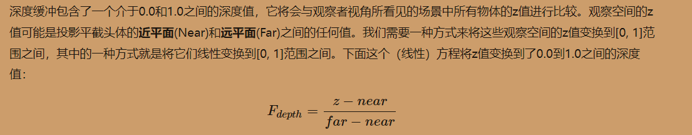
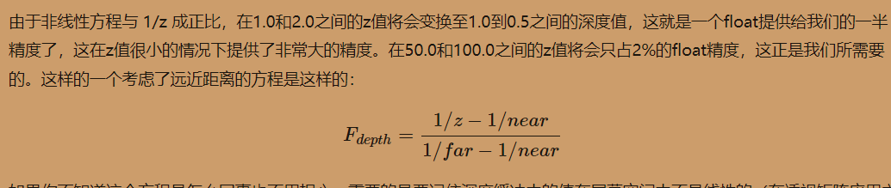
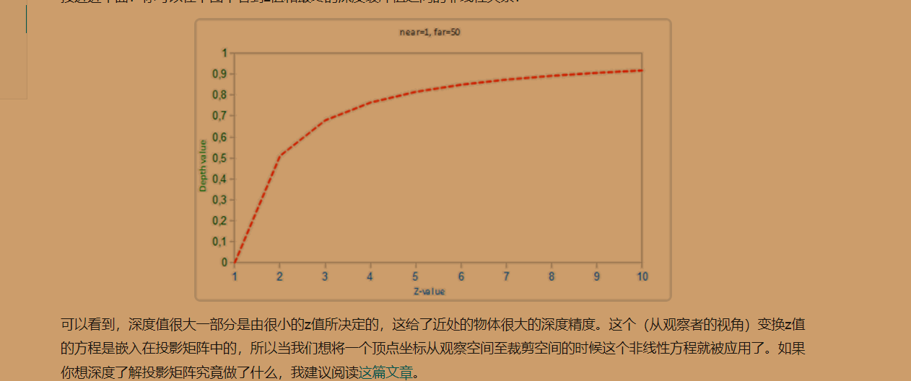

# 高级opengl功能

## 深度缓冲
### 意义：
且运用了深度缓冲(Depth Buffer)来防止被阻挡的面渲染到其它面的前面。
当深度测试(Depth Testing)被启用的时候，OpenGL会将一个片段的深度值与深度缓冲的内容进行对比。OpenGL会执行一个深度测试，如果这个测试通过了的话，深度缓冲将会更新为新的深度值。如果深度测试失败了，片段将会被丢弃。

### 注意：
现在大部分的GPU都提供一个叫做提前深度测试(Early Depth Testing)的硬件特性。提前深度测试允许深度测试在片段着色器之前运行。只要我们清楚一个片段永远不会是可见的（它在其他物体之后），我们就能提前丢弃这个片段。
片段着色器通常开销都是很大的，所以我们应该尽可能避免运行它们。当使用提前深度测试时，片段着色器的一个限制是你不能写入片段的深度值。如果一个片段着色器对它的深度值进行了写入，提前深度测试是不可能的。OpenGL不能提前知道深度值。

### 通过深度测试
一直通过的话，就是最后面绘制的会盖在之前的物体上面

### codes:
glEnable(GL_DEPTH_TEST); 开启深度测试 通过z值来判断

### 深度值精度：
#### 线性深度(一般考虑投影是不会使用的)
思想也是占比大小

#### 非线性

小部分的z值 决定了大部分深度值
解析：https://www.songho.ca/opengl/gl_projectionmatrix.html

## FBO framebufferObject 帧缓冲对象
