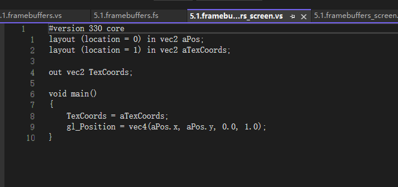

- [问题：](#问题)
  - [1、那一个 fbo可以同时被 纹理和rbo 附加吗](#1那一个-fbo可以同时被-纹理和rbo-附加吗)
  - [2、获取屏幕数据，glReadPixels](#2获取屏幕数据glreadpixels)
    - [1. 直接渲染到默认帧缓冲并获取图像数据](#1-直接渲染到默认帧缓冲并获取图像数据)
      - [示例代码](#示例代码)
    - [2. 使用帧缓冲对象（FBO）并获取图像数据](#2-使用帧缓冲对象fbo并获取图像数据)
      - [示例代码](#示例代码-1)
    - [性能对比与考虑](#性能对比与考虑)
      - [直接渲染到默认帧缓冲](#直接渲染到默认帧缓冲)
      - [使用帧缓冲对象（FBO）](#使用帧缓冲对象fbo)
    - [最佳实践](#最佳实践)
    - [结论](#结论)
  - [3、opengl 如果用帧缓冲 获取gl绘制信息，然后通过图片导出来，可以不创建gl窗口环境吗](#3opengl-如果用帧缓冲-获取gl绘制信息然后通过图片导出来可以不创建gl窗口环境吗)
  - [4、镜像](#4镜像)
- [高级opengl功能](#高级opengl功能)
  - [深度缓冲](#深度缓冲)
    - [意义：](#意义)
    - [注意：](#注意)
    - [通过深度测试](#通过深度测试)
    - [codes:](#codes)
    - [深度值精度：](#深度值精度)
      - [线性深度(一般考虑投影是不会使用的)](#线性深度一般考虑投影是不会使用的)
      - [非线性](#非线性)
      - [\*\*\*\*!!!!!!!个人理解：](#个人理解)
    - [深度冲突](#深度冲突)
    - [防止深度冲突](#防止深度冲突)
  - [模板测试](#模板测试)
    - [示例代码](#示例代码-2)
    - [](#)
    - [绘制一轮结束后，然后重置代码意义](#绘制一轮结束后然后重置代码意义)
    - [流程](#流程)
  - [混合 blending](#混合-blending)
    - [blending 函数](#blending-函数)
  - [面剔除](#面剔除)
    - [作用：](#作用)
    - [解释：](#解释)
    - [主要解决：](#主要解决)
    - [实现技巧：](#实现技巧)
    - [实现函数](#实现函数)
  - [FBO framebufferObject 帧缓冲对象](#fbo-framebufferobject-帧缓冲对象)
    - [流程：](#流程-1)
      - [绑定：](#绑定)
      - [成为完整的条件：](#成为完整的条件)
      - [离屏渲染(渲染到非屏幕默认缓冲的帧缓冲上即为离屏渲染)](#离屏渲染渲染到非屏幕默认缓冲的帧缓冲上即为离屏渲染)
      - [渲染缓冲对象附件](#渲染缓冲对象附件)
        - [好处：](#好处)
  - [高级glsl](#高级glsl)
    - [uniform 块布局](#uniform-块布局)
      - [顶点着色器](#顶点着色器)
      - [片段着色器](#片段着色器)
      - [总结](#总结)
  - [几何着色器 （pass 暂时不用到）](#几何着色器-pass-暂时不用到)
  - [实例化 (多个相同的模型 使用， uniform块布局 是多个shader)](#实例化-多个相同的模型-使用-uniform块布局-是多个shader)
      - [函数原型](#函数原型)
      - [参数说明](#参数说明)
      - [情况一：实例数据少于实例化绘制数量](#情况一实例数据少于实例化绘制数量)
      - [情况二：实例数据多于实例化绘制数量](#情况二实例数据多于实例化绘制数量)
  - [抗锯齿](#抗锯齿)
    - [超采样抗锯齿 super sample anti-aliasing ,ssaa](#超采样抗锯齿-super-sample-anti-aliasing-ssaa)
    - [多重采样 multiple sample anti-aliasing ,msaa](#多重采样-multiple-sample-anti-aliasing-msaa)
      - [opengl 调用msaa](#opengl-调用msaa)
      - [离屏的MSAA](#离屏的msaa)
    - [1. `glBindFramebuffer(GL_READ_FRAMEBUFFER, framebuffer);`](#1-glbindframebuffergl_read_framebuffer-framebuffer)
    - [2. `glBindFramebuffer(GL_DRAW_FRAMEBUFFER, intermediateFBO);`](#2-glbindframebuffergl_draw_framebuffer-intermediatefbo)
    - [3. `glBlitFramebuffer(0, 0, SCR_WIDTH, SCR_HEIGHT, 0, 0, SCR_WIDTH, SCR_HEIGHT, GL_COLOR_BUFFER_BIT, GL_NEAREST);`](#3-glblitframebuffer0-0-scr_width-scr_height-0-0-scr_width-scr_height-gl_color_buffer_bit-gl_nearest)
    - [总结](#总结-1)

# 问题：


## 1、那一个 fbo可以同时被 纹理和rbo 附加吗
是的，一个帧缓冲对象（Framebuffer Object, FBO）可以同时附加纹理对象和渲染缓冲对象。这是常见的做法。例如，你可以将颜色附件附加到纹理对象，而将深度和/或模板附件附加到渲染缓冲对象。这样可以利用纹理进行后处理效果，同时使用渲染缓冲对象来存储深度和模板数据，从而提高性能。


## 2、获取屏幕数据，glReadPixels
在OpenGL中，无论是直接渲染到默认帧缓冲还是使用帧缓冲对象（FBO），获取当前渲染图像的数据通常通过类似的方法进行：调用`glReadPixels`函数。虽然两者的实现细节不同，但获取图像数据的基本思路和性能考虑是相似的。下面我们详细探讨这两种情况下获取当前渲染图像数据的方式和相关的性能问题。
### 1. 直接渲染到默认帧缓冲并获取图像数据
当你直接渲染到默认帧缓冲时，你可以使用`glReadPixels`函数从窗口系统提供的帧缓冲中读取像素数据。
#### 示例代码
```cpp
// 绑定默认帧缓冲
glBindFramebuffer(GL_FRAMEBUFFER, 0);
// 分配足够的存储空间以保存像素数据
GLubyte* data = new GLubyte[width * height * 4]; // 假设RGBA格式
// 从默认帧缓冲中读取像素数据
glReadPixels(0, 0, width, height, GL_RGBA, GL_UNSIGNED_BYTE, data);
```
### 2. 使用帧缓冲对象（FBO）并获取图像数据
如果你使用FBO进行渲染，你可以先绑定FBO并渲染到其中，然后使用`glReadPixels`从FBO中读取像素数据。
#### 示例代码
```cpp
// 假设 framebuffer 是已经创建并设置好的帧缓冲对象
glBindFramebuffer(GL_FRAMEBUFFER, framebuffer);
// 分配足够的存储空间以保存像素数据
GLubyte* data = new GLubyte[width * height * 4]; // 假设RGBA格式
// 从FBO中读取像素数据
glReadPixels(0, 0, width, height, GL_RGBA, GL_UNSIGNED_BYTE, data);
```
### 性能对比与考虑
#### 直接渲染到默认帧缓冲
- **优点:** 
  - 直接读取屏幕内容gg，通常在简单应用中足够高效。
- **缺点:**
  - 如果涉及分辨率较大或频繁的读取操作，可能会产生性能瓶颈，因为读回操作涉及CPU与GPU间的数据传递，速度较慢。
#### 使用帧缓冲对象（FBO）
- **优点:**
  - 更灵活，可以先进行复杂渲染和后处理，再一次性读取结果。
  - 可以避免不断地切换上下文（例如，在多通过渲染中）。
  - 在某些情况下可以提高性能，例如针对特定后处理中只需要读取特定颜色附件的数据。
- **缺点:**
  - 初始化和管理FBO的开销较大，尤其是在高频次创建和销毁FBO的情况下。
  - `glReadPixels` 函数本身仍然是一个性能开销大的操作，不管是从默认帧缓冲还是从FBO读取。
### 最佳实践
为了优化从帧缓冲读取数据的性能，可以考虑以下几点：
1. **避免频繁读取：** `glReadPixels` 是一个相对较慢的操作，尽量减少调用频率。如果可能，尝试将数据读取操作批量化。
2. **逐行读取：** 若不需要整张图片，可仅获取感兴趣的区域，从而减少读取的数据量。
3. **异步读取：** 利用 OpenGL 的 Pixel Buffer Object (PBO) 进行异步像素传输，从而在读取像素数据时不会阻塞 GPU 操作。
4. **尽量使用 FBO 进行离屏渲染：** 使用 FBO 提供了更灵活的渲染流程，可以实现各种后处理效果，在读取数据时可根据需求具体优化。
### 结论
无论是直接从默认帧缓冲读取图像数据，还是通过FBO进行渲染并读取数据，都可以使用`glReadPixels`。从性能角度看，两者的性能瓶颈主要来自于`glReadPixels`操作本身。因此，关键在于减少读取频率、合理使用FBO进行灵活渲染，并尽量使用异步读取技术来减少性能开销。根据具体应用场景选择合适的方法，才能在保持灵活性的同时优化性能。


这个就是一个纹理的 id 进行插入到新的着色器 sample上面即可。


## 3、opengl 如果用帧缓冲 获取gl绘制信息，然后通过图片导出来，可以不创建gl窗口环境吗
在OpenGL中，帧缓冲对象（Framebuffer Object, FBO）可以用来离屏渲染，这样你就可以将渲染结果保存为图像文件。但是，要使用OpenGL进行渲染操作，通常仍然需要一个OpenGL上下文环境，哪怕这个上下文环境并不绑定到一个实际的窗口上。
大多数情况下，OpenGL上下文环境是通过创建一个窗口来实现的，但有一些特殊的方法可以在没有窗口的情况下创建OpenGL上下文，比如使用PBuffer或像EGL这样的库来创建一个没有实际可见窗口的上下文。以下是一些可能的方案：
1. **使用PBuffer**:
   - 平台：Windows (WGL)、Linux (GLX)
   - PBuffer (Pixel Buffer) 是一种OpenGL提供的用于离屏渲染的技术。你可以创建一个PBuffer并在其上创建OpenGL上下文，而无需创建一个可见窗口。
2. **使用EGL**:
   - 平台：跨平台
   - EGL 是一个接口，它可以创建OpenGL上下文和管理图形资源而无需依赖于具体窗口系统。EGL允许在各种硬件设备和平台上创建OpenGL上下文，包括无头服务器（headless server）。
3. **使用OSMesa**:
   - 平台：跨平台
   - OSMesa（Off-Screen Mesa）是Mesa 3D中的一个接口，允许你在没有窗口系统支持的情况下创建OpenGL上下文，并渲染到用户指定的内存区域。

## 4、镜像
要点：就是VBO 获取的顶点其实是 关于窗口的  -1 到 1 这个正方形的坐标，直接绘制就是，具体的坐标位置，然后帧缓冲在加上一个 显示区域的vbo坐标，可以以帧缓冲窗口来绘制

正常附件 纹理或者rbo 都是 屏幕窗口的大小的。


# 高级opengl功能
## 深度缓冲
### 意义：
且运用了深度缓冲(Depth Buffer)来防止被阻挡的面渲染到其它面的前面。
当深度测试(Depth Testing)被启用的时候，OpenGL会将一个片段的深度值与深度缓冲的内容进行对比。OpenGL会执行一个深度测试，如果这个测试通过了的话，深度缓冲将会更新为新的深度值。如果深度测试失败了，片段将会被丢弃。

深度缓冲区存储的是归一化后的深度值（0到1之间），而Z值是物体在视线方向上的实际深度坐标（可能是任意范围）。通过深度缓冲区和深度测试，图形渲染系统能够正确决定哪些像素应该被显示，以产生正确的视觉效果。

被遮挡的片段会被深度测试给缓冲掉。
### 注意：
现在大部分的GPU都提供一个叫做提前深度测试(Early Depth Testing)的硬件特性。提前深度测试允许深度测试在片段着色器之前运行。只要我们清楚一个片段永远不会是可见的（它在其他物体之后），我们就能提前丢弃这个片段。
片段着色器通常开销都是很大的，所以我们应该尽可能避免运行它们。当使用提前深度测试时，片段着色器的一个限制是你不能写入片段的深度值。如果一个片段着色器对它的深度值进行了写入，提前深度测试是不可能的。OpenGL不能提前知道深度值。

### 通过深度测试
一直通过的话，就是最后面绘制的会盖在之前的物体上面

### codes:
glEnable(GL_DEPTH_TEST); 开启深度测试 通过z值来判断

### 深度值精度：
#### 线性深度(一般考虑投影是不会使用的)
思想也是占比大小

#### 非线性


小部分的z值 决定了大部分深度值  这个也是 思想也是反着的占用比例， 
解析：https://www.songho.ca/opengl/gl_projectionmatrix.html


0-1 深度转化NDC 过程
#### ****!!!!!!!个人理解：
就是两个物体在离近平面 很近的时候， 细微的差异 就能立马分辨出来，然后 着色器就可以丢弃比较后面的片段, 比较远的 差的很远 也可能重叠
比如近平面为0.1 ，然后远平面100 
然后 两个近的 比如 zvalue 1.1 和 1.2 那么他们深度值就可能是 0.20 和 0.28 区别
然后 zvalue 90 和 100的  深度值可能就是  0.994 和 1 的区别，后者虽然 zvalue差别10 然后 深度值 差特别的小，然后距离近平面越近 越能防止深度缓冲的冲突
所以所以，距离近平面比较近的  片段，在摄像机拉远的时候，就变化比较快，很远的 拉动同样的摄像机的距离 大小变化幅度比较的小 

```
#version 330 core
out vec4 FragColor;

float near = 0.1; 
float far  = 100.0; 

float LinearizeDepth(float depth) 
{
    float z = depth * 2.0 - 1.0; // back to NDC 
    return (2.0 * near * far) / (far + near - z * (far - near));    
}

void main()
{             
    float depth = LinearizeDepth(gl_FragCoord.z) / far; // 为了演示除以 far 不然0，1这个范围有点小一下子就全白了，除以far更好的演示
    FragColor = vec4(vec3(depth), 1.0);
}
```
### 深度冲突
fragment 在同一个深度抢着绘制
### 防止深度冲突
第一个也是最重要的技巧是永远不要把多个物体摆得太靠近，以至于它们的一些三角形会重叠。通过在两个物体之间设置一个用户无法注意到的偏移值，你可以完全避免这两个物体之间的深度冲突。在箱子和地板的例子中，我们可以将箱子沿着正y轴稍微移动一点。箱子位置的这点微小改变将不太可能被注意到，但它能够完全减少深度冲突的发生。然而，这需要对每个物体都手动调整，并且需要进行彻底的测试来保证场景中没有物体会产生深度冲突。

第二个技巧是尽可能将近平面设置远一些。在前面我们提到了精度在靠近近平面时是非常高的，所以如果我们将近平面远离观察者，我们将会对整个平截头体有着更大的精度。然而，将近平面设置太远将会导致近处的物体被裁剪掉，所以这通常需要实验和微调来决定最适合你的场景的近平面距离。

另外一个很好的技巧是牺牲一些性能，使用更高精度的深度缓冲。大部分深度缓冲的精度都是24位的，但现在大部分的显卡都支持32位的深度缓冲，这将会极大地提高精度。所以，牺牲掉一些性能，你就能获得更高精度的深度测试，减少深度冲突。

我们上面讨论的三个技术是最普遍也是很容易实现的抗深度冲突技术了。还有一些更复杂的技术，但它们依然不能完全消除深度冲突。深度冲突是一个常见的问题，但如果你组合使用了上面列举出来的技术，你可能不会再需要处理深度冲突了。


## 模板测试
模板缓冲是否能做类似裁剪的功能
是的，模板缓冲区（Stencil Buffer）在OpenGL中可以用于实现类似裁剪的功能。实际上，模板缓冲区提供了一种非常灵活和强大的方法来限制渲染区域或应用复杂的遮罩，从而达到裁剪的效果。
下面是一些使用模板缓冲区进行“裁剪”操作的基本步骤：
1. **配置模板缓冲区**：初始化和清除模板缓冲区。
2. **创建裁剪区域**：利用模板缓冲区标记出将要被裁剪的区域。
3. **应用裁剪区域**：根据模板缓冲区中的标记来决定哪些片段应该被渲染。
### 示例代码
假设我们想在一个窗口中裁剪出一个圆形区域，只允许在该区域内进行绘制：
```cpp
#include <GL/glut.h>
#include <math.h>
void display() {
    glClear(GL_COLOR_BUFFER_BIT | GL_DEPTH_BUFFER_BIT | GL_STENCIL_BUFFER_BIT);
    // 启用模板测试
    glEnable(GL_STENCIL_TEST);
    
    // 配置模板缓冲区，初始化为0
    glClearStencil(0);
    glClear(GL_STENCIL_BUFFER_BIT);
    // 第一步：在模板缓冲区中标记出圆形区域
    glStencilFunc(GL_ALWAYS, 1, 0xFF); // 总是通过模板测试
    glStencilOp(GL_REPLACE, GL_REPLACE, GL_REPLACE); // 设置模板缓冲区的值为1
    // 绘制一个覆盖整个窗口的圆形
    glBegin(GL_TRIANGLE_FAN);
    glVertex2f(0.0f, 0.0f);
    int numSegments = 100;
    float radius = 0.5f;
    for (int i = 0; i <= numSegments; ++i) {
        float angle = 2.0f * M_PI * float(i) / float(numSegments);
        float x = radius * cosf(angle);
        float y = radius * sinf(angle);
        glVertex2f(x, y);
    }
    glEnd();
    // 第二步：使用模板缓冲区进行裁剪
    glStencilFunc(GL_EQUAL, 1, 0xFF); // 仅当模板缓冲区的值为1时通过测试
    glStencilOp(GL_KEEP, GL_KEEP, GL_KEEP); // 保持模板缓冲区的值不变
    // 在裁剪区域内绘制内容
    glColor3f(0.0, 1.0, 0.0);
    glBegin(GL_QUADS);
    glVertex2f(-0.75, -0.75);
    glVertex2f( 0.75, -0.75);
    glVertex2f( 0.75,  0.75);
    glVertex2f(-0.75,  0.75);
    glEnd();
    // 禁用模板测试
    glDisable(GL_STENCIL_TEST);
    glutSwapBuffers();
}
int main(int argc, char** argv) {
    glutInit(&argc, argv);
    glutInitDisplayMode(GLUT_DOUBLE | GLUT_RGB | GLUT_DEPTH | GLUT_STENCIL);
    glutCreateWindow("Stencil Buffer Clipping Example");
    glutDisplayFunc(display);
    glutMainLoop();
    return 0;
}
```
在这个示例中，我们首先在模板缓冲区中标记出一个圆形区域，然后在该区域内进行绘制。具体步骤如下：
1. **启用模板测试并清除模板缓冲区**：
    - 使用 `glEnable(GL_STENCIL_TEST)` 启用模板测试。
    - 使用 `glClearStencil(0)` 和 `glClear(GL_STENCIL_BUFFER_BIT)` 清除模板缓冲区并初始化为0。
2. **标记裁剪区域**：
    - 通过设置 `glStencilFunc(GL_ALWAYS, 1, 0xFF)` 来确保所有片段都通过模板测试，并使用 `glStencilOp(GL_REPLACE, GL_REPLACE, GL_REPLACE)` 将模板缓冲区的对应值设置为1。
    - 然后绘制一个圆形，将模板缓冲区的对应位置标记为1。
3. **应用裁剪区域**：
    - 设置 `glStencilFunc(GL_EQUAL, 1, 0xFF)`，仅允许模板缓冲区值为1的片段通过，然后绘制内容。
4. **禁用模板测试**：
    - 使用 `glDisable(GL_STENCIL_TEST)` 禁用模板测试。
这种方式使用模板缓冲区实现了一个简单的圆形裁剪区域，当然，你可以根据需求绘制不同形状和复杂度的裁剪区域。


作为模板的先设置为always 然后


### 
模板加上深度


模板不加上深度


### 绘制一轮结束后，然后重置代码意义
在OpenGL中，当一轮绘制结束后，添加以下代码有助于重置和清理不同的状态，以便为下一轮绘制做好准备：
```cpp
glBindVertexArray(0);
glStencilMask(0xFF);
glStencilFunc(GL_ALWAYS, 0, 0xFF);
glEnable(GL_DEPTH_TEST);
```
让我们逐一分析这些操作：
1. `glBindVertexArray(0);`
   - 这行代码解除绑定当前的顶点数组对象（VAO）。解除绑定可以确保不会意外修改当前VAO，并且在下次绘制时从一个已知的状态开始。
2. `glStencilMask(0xFF);`
   - 设置模板掩码为全1（0xFF）。模板掩码控制哪个位可以在模板缓冲区中被写入。将它重置为0xFF表示可以写入所有位。这是一个重置操作，确保未来的绘制操作不会被之前设置的模板掩码限制。
3. `glStencilFunc(GL_ALWAYS, 0, 0xFF);`
   - 这个函数设置模板测试函数。当`GL_ALWAYS`被指定时，总是通过模板测试，新的模板值会被写入模板缓冲区。这样做确保以后的绘制操作不受之前可能设定的模板测试条件的影响。
4. `glEnable(GL_DEPTH_TEST);`
   - 启用深度测试，确保以后的绘制操作在深度缓冲区中进行正确的深度测试。如果深度测试之前被禁用，这行代码会重新启用它。
总结来说，这些操作的目的是为了确保每次绘制之前，OpenGL状态是重置到一个已知的、干净的状态。这可以避免各种潜在的问题，例如，前一轮绘制设置了某些状态，但是下一轮绘制没有显式地修改这些状态，从而导致不可预期的结果。通过重置关键的状态，可以确保每次绘制的结果都是可预见和可控的。


### 流程
一开始是模板缓冲清空为0的

先把原来的区域设置为1，然后开启模板缓冲填入，就把第一个模板冲刷为模板1的函数

在替换这边也很有讲究的
glStencilFunc(GL_NOTEQUAL, 1, 0xFF);
glStencilOp(GL_KEEP, GL_KEEP, GL_REPLACE);
## 混合 blending
透明的部分就丢弃掉对应的片段即可就是实现透明的效果
片段着色器的 discard命令，一旦被调用该片段就不会继续被执行。

混色公式
简单来说就是自己的颜色所在的比例。
### blending 函数
glBlendFunc函数 正常是相加

glBlendEquation 函数 可以改变相减，和减的顺序

不过深度缓冲会导致后面的片段被舍弃掉

发生这一现象的原因是，深度测试和混合一起使用的话会产生一些麻烦。当写入深度缓冲时，深度缓冲不会检查片段是否是透明的，所以透明的部分会和其它值一样写入到深度缓冲中。结果就是窗户的整个四边形不论透明度都会进行深度测试。即使透明的部分应该显示背后的窗户，深度测试仍然丢弃了它们。

所以我们不能随意地决定如何渲染窗户，让深度缓冲解决所有的问题了。这也是混合变得有些麻烦的部分。要想保证窗户中能够显示它们背后的窗户，我们需要首先绘制背后的这部分窗户。这也就是说在绘制的时候，我们必须先手动将窗户按照最远到最近来排序，再按照顺序渲染。

注意，对于草这种全透明的物体，我们可以选择丢弃透明的片段而不是混合它们，这样就解决了这些头疼的问题（没有深度问题）。

解决方法：
通过一个map 记录他们的距离，和摄像机的距离，然后排序，从远到近进行绘制。


## 面剔除
### 作用：
 就是我们在一个时间里面，同时看到的一个正方体的面数 是不可能4面全的，有的特定角度只能一面，所以把看不到的不渲染，就可以提高渲染效率了。
### 解释：
这正是面剔除(Face Culling)所做的。OpenGL能够检查所有面向(Front Facing)观察者的面，并渲染它们，而丢弃那些背向(Back Facing)的面，节省我们很多的片段着色器调用（它们的开销很大！）。但我们仍要告诉OpenGL哪些面是正向面(Front Face)，哪些面是背向面(Back Face)。OpenGL使用了一个很聪明的技巧，分析顶点数据的环绕顺序(Winding Order)。

### 主要解决：
如何判断哪些面是面向用户，哪些是看不到的。


### 实现技巧：
利用环绕顺序技巧：
函数
当你定义顶点顺序的时候，你应该想象对应的三角形是面向你的，所以你定义的三角形从正面看去应该是逆时针的。这样定义顶点很棒的一点是，实际的环绕顺序是在光栅化阶段进行的，也就是顶点着色器运行之后。这些顶点就是从观察者视角所见的了。

### 实现函数
glEnable(GL_CULL_FACE);
glCullFace 剔除的可选项
GL_BACK：只剔除背向面。
GL_FRONT：只剔除正向面。
GL_FRONT_AND_BACK：剔除正向面和背向面。

## FBO framebufferObject 帧缓冲对象


glCheckFramebufferStatus 使用该函数检查真缓冲是否完整

### 流程：
#### 绑定：
glbindframebuffer(GL_FREAMEBUFFER,fbo);
在绑定到GL_FRAMEBUFFER目标之后，所有的读取和写入帧缓冲都是当前的帧缓冲，
可以绑定GL_READ_FRAMEBUFFER或者GL_DRAW_FRAMEBUFFER 分别绑定在读或者写的上面
绑定到GL_READ_FRAMEBUFFER的帧缓冲将会使用在所有像是glReadPixels的读取操作中，而绑定到GL_DRAW_FRAMEBUFFER的帧缓冲将会被用作渲染、清除等写入操作的目标。大部分情况你都不需要区分它们，
通常都会使用GL_FRAMEBUFFER，绑定到两个上上。 

#### 成为完整的条件：
1、附加至少一个缓冲
2、至少有一个颜色附件
3、所有附件都必须是完整的 保留了内存
4、每个缓冲都应有相同的样本数


#### 离屏渲染(渲染到非屏幕默认缓冲的帧缓冲上即为离屏渲染)
之后所有的渲染操作将会渲染到当前绑定帧缓冲的附件中。
由于我们的帧缓冲不是默认帧缓冲，
渲染指令将不会对窗口的视觉输出有任何影响。出于这个原因，
渲染到一个不同的帧缓冲被叫做离屏渲染(Off-screen Rendering)。
要保证所有的渲染操作在主窗口中有视觉效果，我们需要再次激活默认帧缓冲，将它绑定到0。

将帧缓冲绑定到默认缓冲上
glBindFramebuffer(GL_FRAMEBUFFER, 0);


#### 渲染缓冲对象附件
renderbuffer object  rbo 是可用的帧缓冲福建类型，和纹理图像一样，渲染缓冲对象是一个真正的缓冲。
##### 好处：
它会将数据储存为OpenGL原生的渲染格式，它是为离屏渲染到帧缓冲优化过的。渲染缓冲对象直接将所有的渲染数据储存到它的缓冲中，不会做任何针对纹理格式的转换，让它变为一个更快的可写储存介质
原生格式，所以复制或者写入到其他缓冲是非常快的。

unsigned int rbo;
glGenRenderbuffers(1, &rbo);
glBindRenderbuffer(GL_RENDERBUFFER, rbo); 
glRenderbufferStorage(GL_RENDERBUFFER, GL_DEPTH24_STENCIL8, 800, 600);  
glBindRenderbuffer(GL_RENDERBUFFER, 0);
当我们为渲染缓冲对象分配了足够的内存之后，我们可以解绑这个渲染缓冲。
接下来，作为完成帧缓冲之前的最后一步，我们将渲染缓冲对象附加到帧缓冲的深度和模板附件上：


绘制到framebuffer上面的 着色器，可以关注 mvp转换东西


然后 绘制fbo里面的 纹理，它的着色器只要关注 图片和坐标即可



帧缓冲可以缓冲对象进行 抗锯齿等提取出来

在OpenGL渲染中，有两种常见的方式将图像绘制到屏幕上：
1. **直接渲染到默认帧缓冲（窗口帧缓冲）**
2. **使用自定义帧缓冲对象（FBO）进行渲染，然后将其结果绘制到默认帧缓冲**
这两种方法各有优缺点，具体选择取决于你的应用需求和性能考虑。
 1. 直接渲染到默认帧缓冲
默认情况下，OpenGL会将渲染操作绘制到一个称为默认帧缓冲的地方，这通常由窗口系统管理。最终结果将显示在屏幕上。
 优点
- **简单且直接**：不需要额外的步骤和设置，可以直接渲染到屏幕上。
- **性能较好**：避免了额外的开销，因为没有中间的帧缓冲对象需要管理和处理。
 缺点
- **灵活性差**：无法进行复杂的后处理效果，比如模糊、HDR、抗锯齿、多重渲染目标等。
- **无法离屏渲染**：无法在离屏缓冲中进行操作，再将结果用于其他纹理或者渲染目标。
 2. 使用帧缓冲对象（FBO）进行渲染然后绘制到默认帧缓冲
这涉及创建一个或多个自定义帧缓冲对象，将渲染操作写入这些帧缓冲，然后将结果绘制到默认帧缓冲。
 优点
- **灵活性高**：可以实现复杂的效果，如后处理（后期处理）、多通过渲染（multi-pass rendering）、延迟渲染（deferred rendering）、阴影贴图（shadow mapping）等。
- **离屏渲染**：允许在离屏缓冲中进行渲染操作，然后再将结果用于纹理或者进一步的渲染阶段。
- **多重渲染目标**：可以同时渲染到多个颜色附件，这对于延迟渲染和其他高级渲染技术非常有用。
 缺点
- **复杂性增加**：需要管理额外的帧缓冲对象、纹理和渲染缓冲对象。这增加了代码的复杂度。
- **额外的开销**：使用帧缓冲对象可能会引入一些额外的性能开销，特别是在切换帧缓冲对象和进行纹理复制时。
 实际应用中的选择
在实际应用中，常常根据需求来选择合适的方法：
- **简单应用和基本渲染**：如果只是做一些简单的绘制，比如在界面中显示基本图形内容，直接渲染到默认帧缓冲通常就足够了。
- **高级渲染和复杂效果**：如果需要实现高级渲染效果和后处理，使用帧缓冲对象则是必要的。例如，许多现代游戏和3D 应用使用 FBO 来实现后效处理（例如模糊、光照、反射等），以及复杂的渲染技术（如延迟渲染）。
 小结
- **直接渲染到默认帧缓冲**: 简单且高效，适用于基础的渲染需求。
- **使用帧缓冲对象（FBO）**: 灵活且功能强大，适用于需要复杂效果和多通过渲染的高级场景。
通过理解这两种方法的优缺点，你可以根据具体需求选择合适的渲染方式来实现最优效果和性能。


## 高级glsl
每个像素都是通过 片段着色器计算的，所以通过坐标位置设置值即可


### uniform 块布局
unniform 通过gpu 获取数据，然后多个着色器绑定 一个gpu的uniform数据
绑定：

数据填充:


注意点：偏移量得在看看。偏移量得经过计算一下
理解：就是多个shader ，应用同一个uniform 可以尝试用这个，省的一个个去修改麻烦。

优势：
- **减少绑定和更新次数**：
  在传统的 `uniform` 更新方式中，每次更改 `uniform` 都需要单独调用 `glUniform*` 函数，这可能导致大量的绑定操作。而通过 UBO，可以一次性更新一组 `uniform`，减少了 API 调用次数，从而提升渲染效率。
- **更快的数据传输**：
  将多个 `uniform` 变量打包成一个块后，数据可以通过一次 `glBufferData` 或 `glBufferSubData` 调用传输到 GPU。这比逐个更新每个 `uniform` 要高效得多。
  ```cpp
  // 传统方法：逐个绑定和更新
  glUseProgram(shaderProgram);
  glUniformMatrix4fv(glGetUniformLocation(shaderProgram, "model"), 1, GL_FALSE, glm::value_ptr(modelMatrix));
  glUniformMatrix4fv(glGetUniformLocation(shaderProgram, "view"), 1, GL_FALSE, glm::value_ptr(viewMatrix));
  glUniformMatrix4fv(glGetUniformLocation(shaderProgram, "projection"), 1, GL_FALSE, glm::value_ptr(projectionMatrix));
  // 使用 UBO 方式：一次性更新
  struct UniformData {
      glm::mat4 model;
      glm::mat4 view;
      glm::mat4 projection;
  } uniformData;
  uniformData.model = modelMatrix;
  uniformData.view = viewMatrix;
  uniformData.projection = projectionMatrix;
  glBindBuffer(GL_UNIFORM_BUFFER, ubo);
  glBufferSubData(GL_UNIFORM_BUFFER, 0, sizeof(uniformData), &uniformData);
  ```  ```cpp
- **共享 `uniform` 数据**：
  UBO 可以在多个着色器程序之间共享 `uniform` 数据，使其更方便管理。例如，光照参数、视图矩阵等常用的 `uniform` 可以通过 UBO 在多个着色器程序中共享，而不需要每个程序单独定义一遍。

### 正背面解答
gl_FrontFacing 这个是不关注 model矩阵的是吧。 只要在顶点设置ok，然后顺逆时针定好，就是确定正背面了吧
确实，`gl_FrontFacing` 主要是基于顶点的绕序（顺时针或逆时针）来确定一个片段是否位于几何体的正面或背面。这个判断过程与视图方向和光栅化阶段有关，具体细节如下：
#### 1. 顶点绕序
在OpenGL中，可以通过设置顶点的绕序来定义三角形的正面和背面：
- 默认情况下，逆时针（CounterClockWise, CCW）顺序的顶点定义正面。
- 可以使用 `glFrontFace(GL_CW)` 或 `glFrontFace(GL_CCW)` 来修改这个行为，从而定义顺时针（ClockWise, CW）或逆时针为正面。
#### 2. 正面和背面的确定
在光栅化阶段，OpenGL会根据顶点的绕序和摄像机位置来确定一个片段是属于三角形的正面还是背面。无论模型矩阵如何变换，只要顶点的相对顺序和视图保持一致，这一判断结果就不会改变。
#### 3. 模型矩阵的影响
模型矩阵（Model Matrix）用于将对象从其本地坐标空间转换到世界坐标空间，影响的是物体在场景中的位置、旋转和缩放。但它不会改变顶点的绕序，因此不会直接影响正面和背面的判断。
#### 综上所述
`gl_FrontFacing` 关注的是顶点在视图变换后的相对顺序，而不是具体的模型矩阵。只要：
- 在顶点着色器中正确设置顶点位置。
- 定义正确的顶点绕序（顺时针或逆时针）。
- 保持视图矩阵和投影矩阵的一致性。
那么，`gl_FrontFacing` 就可以准确地判断哪个片段是正面，哪个片段是背面。
#### 示例代码
#### 顶点数据设置
定义一个矩形的顶点数据，其中包括顶点位置和纹理坐标：
```cpp
float vertices[] = {
    // positions         // texture coords
    0.5f,  0.5f, 0.0f,   1.0f, 1.0f, // top right
    0.5f, -0.5f, 0.0f,   1.0f, 0.0f, // bottom right
   -0.5f, -0.5f, 0.0f,   0.0f, 0.0f, // bottom left
   -0.5f,  0.5f, 0.0f,   0.0f, 1.0f  // top left 
};
unsigned int indices[] = {  // 注意顺序
    0, 1, 3,   // 第一个三角形
    1, 2, 3    // 第二个三角形
};
```
#### 顶点着色器
在顶点着色器中，将顶点位置转换到裁剪空间，并且传递纹理坐标：
```glsl
#version 330 core
layout(location = 0) in vec3 aPos;    // 顶点位置
layout(location = 1) in vec2 aTexCoords; // 纹理坐标
out vec2 TexCoords;
uniform mat4 model;
uniform mat4 view;
uniform mat4 projection;
void main()
{
    gl_Position = projection * view * model * vec4(aPos, 1.0);
    TexCoords = aTexCoords;
}
```
#### 片段着色器
在片段着色器中，根据 `gl_FrontFacing` 的值判断当前片段是正面还是背面，并赋予不同的颜色：
```glsl
#version 330 core
in vec2 TexCoords;
out vec4 FragColor;
uniform sampler2D texture1;
void main()
{
    if (gl_FrontFacing) {
        FragColor = texture(texture1, TexCoords); // 正面使用纹理颜色
    } else {
        FragColor = vec4(1.0, 0.0, 0.0, 1.0); // 背面使用红色
    }
}
```
#### 总结
1. **顶点顺序**：确保顶点的顺时针或逆时针顺序是正确的，以定义几何体的正面和背面。
2. **视角和光栅化**：在绘制过程中，OpenGL光栅化阶段会基于顶点顺序和视图方向来判断每个片段的 `gl_FrontFacing` 值。
3. **模型矩阵无关**：模型矩阵只是改变物体在世界空间中的位置、旋转和缩放，而不会影响顶点的绕序，因此它不会直接影响 `gl_FrontFacing` 的判断。
通过正确设置顶点和利用 `gl_FrontFacing`，你可以实现双面着色或其他基于面向信息的效果。


## 几何着色器 （pass 暂时不用到）

## 实例化 (多个相同的模型 使用， uniform块布局 是多个shader)
假设你有一个绘制了很多模型的场景，而大部分的模型包含的是同一组顶点数据，只不过进行的是不同的世界空间变换。想象一个充满草的场景：每根草都是一个包含几个三角形的小模型。你可能会需要绘制很多根草，最终在每帧中你可能会需要渲染上千或者上万根草。因为每一根草仅仅是由几个三角形构成，渲染几乎是瞬间完成的，但上千个渲染函数调用却会极大地影响性能。


glDrawArrays或glDrawElements函数告诉GPU去绘制你的顶点数据会消耗更多的性能 ，cpu命令GPU的渲染速度没那么快


威廉:
`glVertexAttribDivisor` 是 OpenGL 的一个函数，它用于设置特定的顶点属性在实例化时的更新频率。这在使用 `glDrawArraysInstanced` 或 `glDrawElementsInstanced` 进行实例化渲染时非常有用。
#### 函数原型
```c
void glVertexAttribDivisor(GLuint index, GLuint divisor);
```
#### 参数说明
- **index**: 指定要修改的顶点属性索引。
- **divisor**: 指定实例化频率。具体来说：
  - 如果 `divisor` 是 `0`，则顶点属性在每个顶点都更新（这是默认行为）。
  - 如果 `divisor` 是 `1`，则顶点属性在每个实例都会更新。
  - 如果 `divisor` 是 `n`，则顶点属性将在 `n` 个实例后更新一次。

威廉:
glDrawArraysInstanced  绘制的实例个数，和vbo数组的数据的数量  不对齐会咋样
在使用 OpenGL 进行实例化渲染时，`glDrawArraysInstanced` 的绘制实例个数（即最后一个参数）与 VBO 中数据数量之间的对齐不匹配可能会导致多种问题。具体情况取决于如何设置和使用这些数据：
#### 情况一：实例数据少于实例化绘制数量
如果实例数据（如颜色、偏移量等）数量少于 `glDrawArraysInstanced` 绘制的实例数，OpenGL 将读取未定义区域中的数据。这可能会导致以下结果：
- 渲染出现错误或异常。
- 渲染出的实例使用未定义的数据，通常是一些奇怪的值。
- 程序崩溃（不太常见，但可能发生）。
#### 情况二：实例数据多于实例化绘制数量
如果实例化数据的数量多于 `glDrawArraysInstanced` 绘制的实例数，则仅会使用前面部分的数据，其余数据将被忽略。这通常不会导致崩溃，但会浪费存储空间。


## 抗锯齿
走样就是有锯齿


### 超采样抗锯齿 super sample anti-aliasing ,ssaa
它会使用比正常分辨率更高的分辨率（即超采样）来渲染场景，当图像输出在帧缓冲中更新时，分辨率会被下采样(Downsample)至正常的分辨率。这些额外的分辨率会被用来防止锯齿边缘的产生。虽然它确实能够解决走样的问题，但是由于这样比平时要绘制更多的片段，它也会带来很大的性能开销。所以这项技术只拥有了短暂的辉煌。
(开销比较大)

### 多重采样 multiple sample anti-aliasing ,msaa
就是原本以一个像素中心点进行采样的


颜色就进入采样的点数，乘上一定的权重


#### opengl 调用msaa
glfwWindowHint(GLFW_SAMPLES, 4); ，把采样点增加为4个
glEnable(GL_MULTISAMPLE); 采用多重采样

#### 离屏的MSAA
采用帧缓冲，加上支持MSAA的纹理
使用glTexImage2DMultisample 代替 glTexImage2D,
纹理目标就是GL_TEXTURE_2D_MULTISAPLE:
glBindTexture(GL_TEXTURE_2D_MULTISAMPLE,tex);
glTexImage2DMultisample(GL_TEXTURE_2D_MULTISAMPLE,samples,GL_RGB,width,height,GL_TRUE);
glBindTexture(GL_TEXTURE_2D_MULTISAMPLE,0);


now blit multisampled buffer(s) to normal colorbuffer of intermediate FBO. Image is stored in screenTexture         glBindFramebuffer(GL_READ_FRAMEBUFFER, framebuffer);         glBindFramebuffer(GL_DRAW_FRAMEBUFFER, intermediateFBO);         glBlitFramebuffer(0, 0, SCR_WIDTH, SCR_HEIGHT, 0, 0, SCR_WIDTH, SCR_HEIGHT, GL_COLOR_BUFFER_BIT, GL_NEAREST);    这三句代码干啥用的

      
这三句代码用于将多重采样帧缓冲（Multisampled Framebuffer）中的数据拷贝到一个普通的颜色缓冲区中。具体来说，这个过程称为“blit”，它是一种高效的数据传输方式。以下是每行代码的详细解释：
### 1. `glBindFramebuffer(GL_READ_FRAMEBUFFER, framebuffer);`
```cpp
glBindFramebuffer(GL_READ_FRAMEBUFFER, framebuffer);
```
这是将一个帧缓冲对象（`framebuffer`）绑定到 `GL_READ_FRAMEBUFFER` 目标。这意味着之后所有的读操作（例如 `glBlitFramebuffer`）都将从这个帧缓冲中读取数据。在这个上下文中，`framebuffer` 应该是一个包含多重采样纹理或渲染缓冲的帧缓冲对象。
### 2. `glBindFramebuffer(GL_DRAW_FRAMEBUFFER, intermediateFBO);`
```cpp
glBindFramebuffer(GL_DRAW_FRAMEBUFFER, intermediateFBO);
```
这是将另一个帧缓冲对象（`intermediateFBO`）绑定到 `GL_DRAW_FRAMEBUFFER` 目标。这意味着之后所有的写操作（例如 `glBlitFramebuffer`）都将写入这个帧缓冲。在这个上下文中，`intermediateFBO` 是一个普通的帧缓冲，它包含一个非多重采样的颜色缓冲区（例如一个简单的2D纹理）。
### 3. `glBlitFramebuffer(0, 0, SCR_WIDTH, SCR_HEIGHT, 0, 0, SCR_WIDTH, SCR_HEIGHT, GL_COLOR_BUFFER_BIT, GL_NEAREST);`
```cpp
glBlitFramebuffer(0, 0, SCR_WIDTH, SCR_HEIGHT, 0, 0, SCR_WIDTH, SCR_HEIGHT, GL_COLOR_BUFFER_BIT, GL_NEAREST);
```
这是执行实际的数据拷贝操作。`glBlitFramebuffer` 用于在帧缓冲对象之间进行高效的位块传送（blit）。参数说明如下：
- `(0, 0, SCR_WIDTH, SCR_HEIGHT)`: 指定源帧缓冲区（即 `GL_READ_FRAMEBUFFER` 绑定的 `framebuffer`）的矩形区域。
- `(0, 0, SCR_WIDTH, SCR_HEIGHT)`: 指定目标帧缓冲区（即 `GL_DRAW_FRAMEBUFFER` 绑定的 `intermediateFBO`）的矩形区域。
- `GL_COLOR_BUFFER_BIT`: 表示只拷贝颜色缓冲数据。
- `GL_NEAREST`: 指定插值方式，这里使用邻近采样（nearest-neighbor interpolation）。
### 总结
这三行代码的主要功能是将一个多重采样的帧缓冲对象中的颜色缓冲区内容高效地拷贝到一个普通的非多重采样帧缓冲对象中。这样做可以在渲染过程中实现抗锯齿效果，因为多重采样缓冲区提供了更平滑的边缘，但最终的结果需要存在普通帧缓冲对象中以进行后续处理或显示。
具体步骤：
1. 将多重采样帧缓冲对象绑定到读取目标。
2. 将普通的（非多重采样）帧缓冲对象绑定到绘制目标。
3. 使用 `glBlitFramebuffer` 方法将多重采样缓冲区的数据拷贝到普通缓冲区。