- [opengl](#opengl)
  - [定义](#定义)
  - [上下文](#上下文)
  - [对象](#对象)
    - [顶点着色器](#顶点着色器)
    - [片段着色器](#片段着色器)
    - [着色流程](#着色流程)
      - [顶点流程-顶点着色器](#顶点流程-顶点着色器)
      - [片段着色器](#片段着色器-1)
      - [链接程序](#链接程序)
    - [EBO渲染](#ebo渲染)
  - [纹理](#纹理)
    - [纹理单元](#纹理单元)
    - [纹理过滤](#纹理过滤)
    - [多级渐远纹理](#多级渐远纹理)
    - [函数](#函数)
  - [原理-图形渲染管线（翻译应该为流程）](#原理-图形渲染管线翻译应该为流程)
- [纹理](#纹理-1)
- [Glfw](#glfw)
  - [参数](#参数)
    - [glfwWindowHint 给窗口设置属性](#glfwwindowhint-给窗口设置属性)
    - [glfwSetFramebufferSizeCallback](#glfwsetframebuffersizecallback)
    - [glfwPollEvents](#glfwpollevents)
    - [glfwWindowShouldClose](#glfwwindowshouldclose)
    - [glfwSwapBuffers](#glfwswapbuffers)
  - [加载显存地址内容](#加载显存地址内容)
- [问题](#问题)
  - [像复杂图形的顶点数据要怎么整理](#像复杂图形的顶点数据要怎么整理)
  - [glGenBuffers glCreateProgram 这些是cpu还是gpu生成的数据](#glgenbuffers-glcreateprogram-这些是cpu还是gpu生成的数据)
  - [glLinkProgram(shaderprogram);  opengl链接什么时候会断开，最多链接几个](#gllinkprogramshaderprogram--opengl链接什么时候会断开最多链接几个)
  - [着色器](#着色器)
- [坐标系统](#坐标系统)
  - [view 矩阵 ，摄像机](#view-矩阵-摄像机)
    - [视图矩阵的概念](#视图矩阵的概念)
    - [从Z+方向看向Z-方向](#从z方向看向z-方向)
    - [lookat](#lookat)
  - [您的示例解释](#您的示例解释)
    - [更详细的步骤解析](#更详细的步骤解析)
  - [透视投影矩阵的结果   过近和过远都会被干掉，不会渲染](#透视投影矩阵的结果---过近和过远都会被干掉不会渲染)
  - [自由移动](#自由移动)
    - [欧拉角](#欧拉角)


## opengl
### 定义
是一个接口，具体的方法由显卡厂商提供，函数指针，需要查找显卡实现方法的指针地址才能使用。
类似如下
// 定义函数原型
typedef void (*GL_GENBUFFERS) (GLsizei, GLuint*);
// 找到正确的函数并赋值给函数指针
GL_GENBUFFERS glGenBuffers  = (GL_GENBUFFERS)wglGetProcAddress("glGenBuffers");
// 现在函数可以被正常调用了
GLuint buffer;
glGenBuffers(1, &buffer);

### 上下文
opengl是一个状态机（待补充完整）

### 对象
顶点数组对象 VAO  
```
!!!!!!!!!!!!!! OpenGL的核心模式要求我们使用VAO，所以它知道该如何处理我们的顶点输入。如果我们绑定VAO失败，OpenGL会拒绝绘制任何东西。!!!!!!!!!!!!!!!!!!!!!!!!!!!!!  
```
顶点缓冲对象 VBO  
    可以一次性发送一大批数据到显卡中，CPU把数据发送在GPU比较慢，所以一次性发送多点数据
  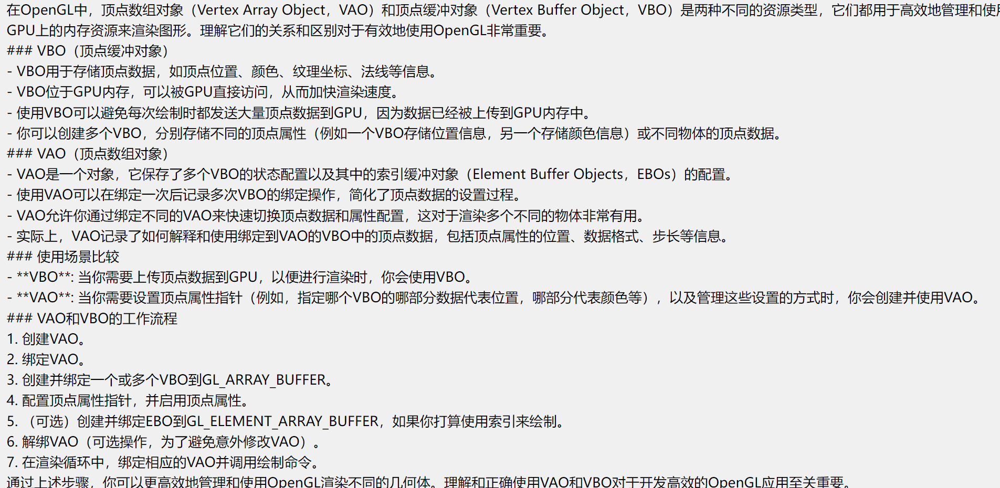
元素缓冲对象 EBO  
就是减少共同顶点而带过来的额外开销

着色器
图元
#### 顶点着色器
确定渲染的位置
#### 片段着色器
片段着色器(Fragment Shader)是第二个也是最后一个我们打算创建的用于渲染三角形的着色器。片段着色器所做的是计算像素最后的颜色输出。
#### 着色流程
##### 顶点流程-顶点着色器
1、创建顶点坐标 char[]  
绑定VAO先，然后设置VBO顶点缓存数据
	// bind the Vertex Array Object first, then bind and set vertex buffer(s), and then configure vertex attributes(s).
	glBindVertexArray(VAO);

2、生成一块显存的内存区域   VBO获取内容开启这个区域的识别码，类似指针接受。
```
glGenBuffers（1，&VBO)
```
```c
第一个参数作用：你是在请求 OpenGL 生成一个新的缓冲对象，并将这个新缓冲对象的唯一标识符放入变量 `VBO`。之后，你可以使用 `VBO` 来引用这个缓冲对象，比如在绑定缓冲对象、向缓冲对象上传数据等操作中。
如果你需要生成多个缓冲对象，你可以增加第一个参数的值，并提供足够大的数组来存储生成的所有缓冲对象的名称，例如：
GLuint buffers[5];
glGenBuffers(5, buffers);
这将生成 5 个新的缓冲对象，并将它们的标识符存储到 `buffers` 数组中。
``` 
3、绑定 GL_ARRAY_BUFFER 内容到这块区域VBO ，使用glBindBuffer(GL_ARRAY_BUFFER,VBO)
4、将用户数据复制到GL_ARRAY_BUFFER内部 
```
glBufferData(GL_ARRAY_BUFFER, sizeof(vertices), vertices, GL_STATIC_DRAW);

GL_STATIC_DRAW ：数据不会或几乎不会改变。
GL_DYNAMIC_DRAW：数据会被改变很多。
GL_STREAM_DRAW ：数据每次绘制时都会改变。
```
5、设置顶点着色器代码
着色器是将用户定义的顶点输入进去，所以以'in'接受
```
const char* vertexShaderSource = "#version 330 core\n"
"layout (location=0) in vec3 aPos;\n"
"void main()\n"
"{\n"
"	gl_Position=vec4(a.Pos.x,aPos.y,aPos.z,1.0);\n"
"}\0";
```
创建着色器变量接受
```
unsigned int vertexShader;
vertexShader = glCreateShader(GL_VERTEX_SHADER);
```

附着着色器，然后编译
glShaderSource(vertexShader,1,&vertexShaderSouece,NULL);
glCompileShader(vertexShader);
```
glShaderSource函数把要编译的着色器对象作为第一个参数。第二参数指定了传递的源码字符串数量，这里只有一个。第三个参数是顶点着色器真正的源码，第四个参数我们先设置为NULL。
```
然后在检查是否编译成功
##### 片段着色器
就是像素的颜色值
```
#version 330 core
out vec4 FragColor;
void main()
{
    FragColor = vec4(1.0f,0.5f,0.2f,1.0f);
}
```
unsigned int fragmentShader;
fragmentShader = glCreateShader(GL_FRAGMENT_SHADER);
glShaderSource(fragmentShader, 1, &fragmentShaderSource, NULL);
glCompileShader(fragmentShader);


##### 链接程序
1、创建程序对象
```
unsigned int shaderProgram;
shaderProgram = glCreateProgram();
```
2、链接两个着色器
```
glAttachShader(shaderProgram,vertexShader);
glAttachShader(shaderProgram,fragmentShader);
glLinkProgram(shaderProgram);
```
3、判断是否链接成功
```
glGetProgramiv(shaderProgram, GL_LINK_STATUS, &success);
if(!success) {
    glGetProgramInfoLog(shaderProgram, 512, NULL, infoLog);
    ...
}
```
4、使用并且删除
glUseProgram(shaderProgram);
glDeleteShader(vertexShader);
glDeleteShader(fragmentShader);

至此我们已经将顶点数据发送，以及怎么着色器处理，但是opengl还不知道怎么释放内存中的数据，以及数据怎么链接到顶点着色器上
glVertexAttribPointer(0,3,GL_FLOAT,GL_FALSE,3*sizeof(float),(void*)0);
glEnableVertexAttribArray(0);

```
glVertexAttribPointer函数的参数非常多，所以我会逐一介绍它们：

第一个参数指定我们要配置的顶点属性。还记得我们在顶点着色器中使用layout(location = 0)定义了position顶点属性的位置值(Location)吗？它可以把顶点属性的位置值设置为0。因为我们希望把数据传递到这一个顶点属性中，所以这里我们传入0。
第二个参数指定顶点属性的大小。顶点属性是一个vec3，它由3个值组成，所以大小是3。
第三个参数指定数据的类型，这里是GL_FLOAT(GLSL中vec*都是由浮点数值组成的)。
下个参数定义我们是否希望数据被标准化(Normalize)。如果我们设置为GL_TRUE，所有数据都会被映射到0（对于有符号型signed数据是-1）到1之间。我们把它设置为GL_FALSE。
第五个参数叫做步长(Stride)，它告诉我们在连续的顶点属性组之间的间隔。由于下个组位置数据在3个float之后，我们把步长设置为3 * sizeof(float)。要注意的是由于我们知道这个数组是紧密排列的（在两个顶点属性之间没有空隙）我们也可以设置为0来让OpenGL决定具体步长是多少（只有当数值是紧密排列时才可用）。一旦我们有更多的顶点属性，我们就必须更小心地定义每个顶点属性之间的间隔，我们在后面会看到更多的例子（译注: 这个参数的意思简单说就是从这个属性第二次出现的地方到整个数组0位置之间有多少字节）。
最后一个参数的类型是void*，所以需要我们进行这个奇怪的强制类型转换。它表示位置数据在缓冲中起始位置的偏移量(Offset)。由于位置数据在数组的开头，所以这里是0。我们会在后面详细解释这个参数。
```

- `index`：指定要启用的顶点数组的索引。
当你调用 `glEnableVertexAttribArray(0);` 时，你正在启用索引为 0 的顶点属性。在着色器中，通常通过 layout 限定符来指定每个 attribute 变量的位置索引


结束后可以解绑此VAO
给其他VAO调用
    // You can unbind the VAO afterwards so other VAO calls won't accidentally modify this VAO, but this rarely happens. Modifying other
    // VAOs requires a call to glBindVertexArray anyways so we generally don't unbind VAOs (nor VBOs) when it's not directly necessary.
    glBindVertexArray(0); 


编译着色器，创建VAO，然后将顶点数据填充（VBO），然后使用着色器绘制，loop渲染
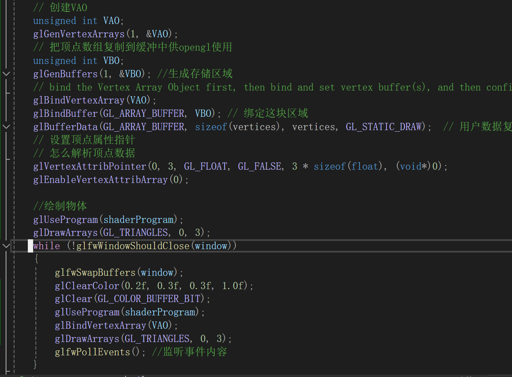


#### EBO渲染

```
	unsigned int EBO;
	glGenBuffers(1, &EBO);
	glBindBuffer(GL_ELEMENT_ARRAY_BUFFER, EBO);
	// 复制数据
	glBufferData(GL_ELEMENT_ARRAY_BUFFER, size(indices), indices, GL_STATIC_DRAW);

	glDrawElements(GL_TRIANGLES,6,GL_UNSIGNALED,0)
```
```
glDrawElements 函数
第一个参数指定了我们绘制的模式，这个和glDrawArrays的一样。第二个参数是我们打算绘制顶点的个数，这里填6，也就是说我们一共需要绘制6个顶点。第三个参数是索引的类型，这里是GL_UNSIGNED_INT。最后一个参数里我们可以指定EBO中的偏移量（或者传递一个索引数组，但是这是当你不在使用索引缓冲对象的时候），但是我们会在这里填写0。
```
注意项：  
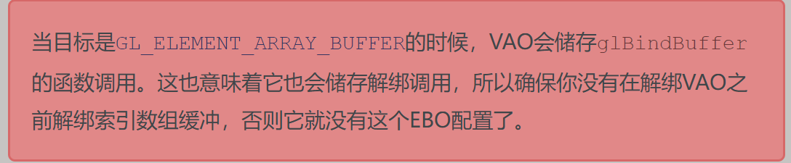
流程生成VAO--绑定VAO--生成VBO赋予顶点数据--绑定定义赐予复制数据--生成EBO--绑定定义赋予共用点的index，然后使用着色器然后需然后 element

### 纹理
glTexParameteri()设置横纵坐标的包裹方式
在片段着色器里面可以混合纹理和颜色
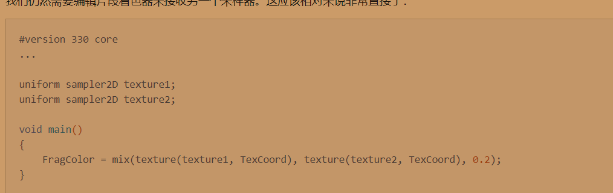

纹理的坐标通过是0，1的，倘若超过1就以 缠绕的方式进行填充

问题： 纹理的坐标和 顶点坐标的关系


#### 纹理单元

激活一个纹理单元然后绑定一个纹理数据

一个纹理单元的位置值通常称为纹理单元

OpenGL至少保证有16个纹理单元供你使用，也就是说你可以激活从GL_TEXTURE0到GL_TEXTRUE15。它们都是按顺序定义的，所以我们也可以通过GL_TEXTURE0 + 8的方式获得GL_TEXTURE8，这在当我们需要循环一些纹理单元的时候会很有用。

给着色器里面的采样器，指定纹理单元的id ，即可实现采样，就是外面通过gluniform1i定位：
类似
glActiveTexture(GL_TEXTURE0);
glBindTexture(GL_TEXTURE_2D, texture1);
glActiveTexture(GL_TEXTURE1);
glBindTexture(GL_TEXTURE_2D, texture2);
glBindVertexArray(VAO);
glDrawElements(GL_TRIANGLES, 6, GL_UNSIGNED_INT, 0);

纹理单元 0和1
然后通过 gl设置
glUniform1i(glGetUniformLocation(ourShader.ID,"texture1"),0)
或者ourShader.setInt("texture",1);


获取图像数据。要注意png 和jpg 设置顶gl_RGB 和gl_RGBA 通道的不同 
glTexImage2D

#### 纹理过滤
邻近过滤 和线性过滤 
邻近就是最相邻的像素色  
线性就是插值   比较模糊，锯齿和颗粒感不会那么强烈
GL_NEAREST产生了颗粒状的图案，我们能够清晰看到组成纹理的像素，而GL_LINEAR能够产生更平滑的图案

#### 多级渐远纹理
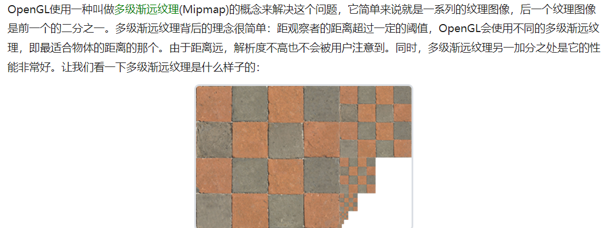
主要是用于缩小，纹理放大不会使用多级渐远纹理

#### 函数
纹理也是根据id引用的。
unsigned int texture；
glgenTextures(1,&texture)

然后绑定 2D 的目标伤
glBindTextTure(GL_TEXTURE_2D,texeture)'
然后可以娜这个GL_TEXTURE_2D 去干事情。

获取用户传进来的数据
glTexImage2D(GL_TEXTURE,0,GL_RGB,width,height,0,GL_RGB,GL_UNSIGNED_BYTE,data)
第二参数 指定多级渐远纹理的级别
第六个参数0  总是0历史问题
当调用glTexImage2D时，当前绑定的纹理对象就会被附加上纹理图像。然而，目前只有基本级别(Base-level)的纹理图像被加载了，如果要使用多级渐远纹理，我们必须手动设置所有不同的图像（不断递增第二个参数）。或者，直接在生成纹理之后调用glGenerateMipmap。这会为当前绑定的纹理自动生成所有需要的多级渐远纹理。

生成纹理后就可以释放内存了。

步骤大致如下
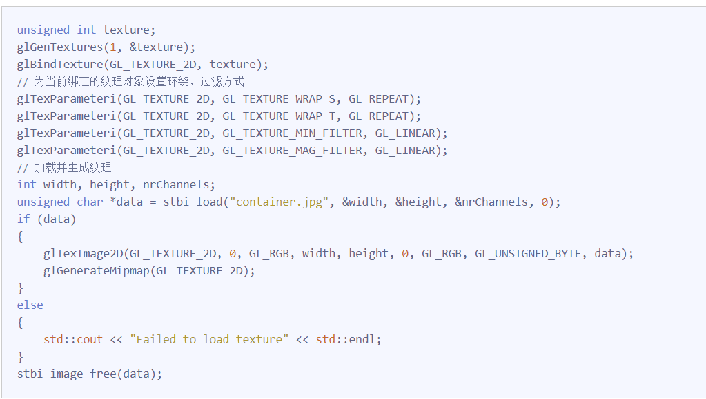
指定 环绕和过滤方式

应用纹理-在顶点着色器上 正常来说是平铺 ，两个点可以锁定平面坐标
float vertices[] = {
//     ---- 位置 ----       ---- 颜色 ----     - 纹理坐标 -
     0.5f,  0.5f, 0.0f,   1.0f, 0.0f, 0.0f,   1.0f, 1.0f,   // 右上
     0.5f, -0.5f, 0.0f,   0.0f, 1.0f, 0.0f,   1.0f, 0.0f,   // 右下
    -0.5f, -0.5f, 0.0f,   0.0f, 0.0f, 1.0f,   0.0f, 0.0f,   // 左下
    -0.5f,  0.5f, 0.0f,   1.0f, 1.0f, 0.0f,   0.0f, 1.0f    // 左上
};


### 原理-图形渲染管线（翻译应该为流程）
opengl是3D控件，屏幕显示是2D，3D转2D就是通过opengl图形渲染管线
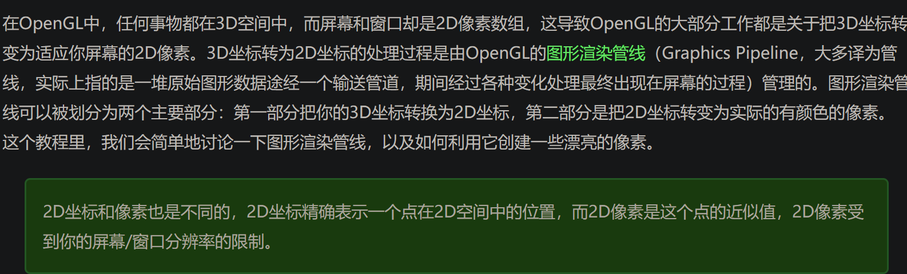

## 纹理
多张纹理
// 这出初始化为单位矩阵
glm::mat4 transform = glm::mat4(1.0f); // make sure to initialize matrix to identity matrix first
一个VAO 可以画多次属性
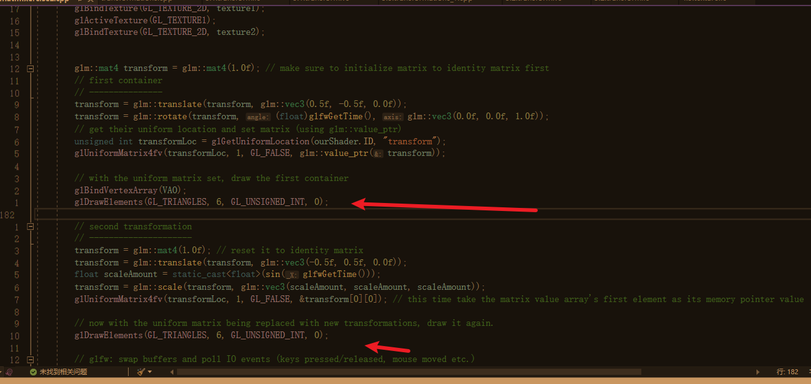
## Glfw
opengl轻量工具集，绘制管理gl窗口上下文 ，提供键盘手柄鼠标输入设备

### 参数
#### glfwWindowHint 给窗口设置属性  
    glfwWindowHint(GLFW_OPENGL_FORWARD_COMPAT, GL_TRUE); 兼容macos
glfwInit 初始化

#### glfwSetFramebufferSizeCallback
告诉glfw每次调整窗口使用这个回调函数

#### glfwPollEvents
接受事件（鼠标键盘等）
#### glfwWindowShouldClose
函数在我们每次循环的开始前检查一次GLFW是否被要求退出，如果是的话，该函数返回true，渲染循环将停止运行，之后我们就可以关闭应用程序glfw

#### glfwSwapBuffers
函数会交换颜色缓冲（它是一个储存着GLFW窗口每一个像素颜色值的大缓冲），它在这一迭代中被用来绘制，并且将会作为输出显示在屏幕上。
### 加载显存地址内容
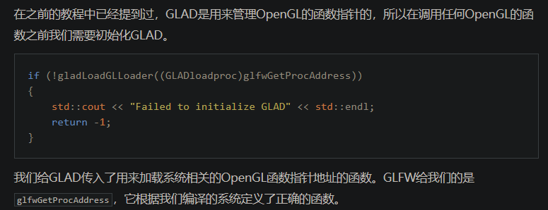
## 问题


### 像复杂图形的顶点数据要怎么整理


### glGenBuffers glCreateProgram 这些是cpu还是gpu生成的数据
`glGenBuffers` 和 `glCreateProgram` 是 OpenGL API 的两个函数，它们用于在使用 OpenGL 进行图形编程时生成资源标识符。
1. `glGenBuffers`：该函数用于生成缓冲区对象标识符，这些标识符代表可以用于存储顶点数据、索引数据、像素数据等的 GPU 内存块。当你调用 `glGenBuffers` 时，实际上是在 CPU 上请求生成一定数量的缓冲区标识符，这些标识符随后可以用来引用 GPU 中的缓冲区资源。但是，在这一步并不会在 GPU 上分配任何实际的内存，实际的内存分配通常在之后通过调用 `glBufferData` 或 `glBufferStorage` 来完成。
2. `glCreateProgram`：该函数用于创建一个新的程序对象，这个程序对象在后续可以附加着色器（如顶点着色器、片元着色器等），用于 GPU 着色器管线。调用 `glCreateProgram` 会在 CPU 上创建标识符，但是关联的着色器代码的编译和链接以及最终的运行都是在 GPU 上进行的。
简而言之，`glGenBuffers` 和 `glCreateProgram` 都是由 CPU 调用的 OpenGL API 函数，用于生成代表 GPU 资源的标识符，但它们并不直接在 GPU 上分配内存或创建资源。实际的 GPU 内存分配和着色器程序的创建、编译等操作发生在之后的步骤中。OpenGL API 作为 CPU 和 GPU 之间的桥梁，提供了一套调用机制来管理 GPU 资源和执行 GPU 计算任务。

###  glLinkProgram(shaderprogram);  opengl链接什么时候会断开，最多链接几个
`glLinkProgram(shaderprogram);` 是 OpenGL API 中用于链接一个着色器程序的函数。这里的“链接”指的是将编译后的着色器（如顶点着色器、片元着色器等）附加到一个程序对象上，并把它们链接成可以在 GPU 上执行的最终程序。链接过程会处理着色器之间的接口匹配，优化和整合代码，并确保着色器程序可以被正确地执行。
一旦链接成功，着色器程序将保持链接状态，直到发生以下情况之一：
1. 如果你显式地删除了着色器程序，使用 `glDeleteProgram`。
2. 如果你的应用程序结束，OpenGL 上下文被销毁，那么所有与该上下文关联的资源（包括链接的着色器程序）也会被释放。
3. 如果你链接了新的着色器到同一个程序对象上并再次调用 `glLinkProgram`，那么原来的链接状态会被新的链接操作所取代。
至于同时可以链接多少个着色器程序，OpenGL 标准本身并没有设置硬性限制。理论上，限制数量取决于系统的内存和 GPU 资源。但在实践中，应用程序通常只会链接它们需要的那些着色器程序，因为每个链接的程序都会消耗宝贵的内存和其他系统资源。因此，开发者通常会根据需要创建和管理一定数量的着色器程序，并在运行时根据需要激活不同的程序。
另外，值得注意的是，现代OpenGL应用程序可能会使用多个着色器程序，通过在渲染流程的不同部分切换当前活跃的着色器程序。一般情况下，会有一个着色器程序管理一个特定的渲染效果或者物体类型。通过调用 `glUseProgram` 来切换当前活跃的着色器程序，以便在绘制不同的对象或者效果时使用不同的渲染策略。
总结来说，`glLinkProgram` 会在程序对象上创建一个链接状态，而这个链接状态会持续存在直到程序对象被显式删除、OpenGL上下文被销毁或者程序对象被重新链接为止，而理论上可以链接的着色器程序数量只受限于系统资源。


### 着色器
着色器得在使用后，在设置值才会生效
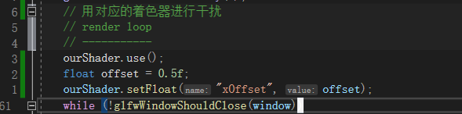


## 坐标系统
最重要的几个分别是模型(Model)、观察(View)、投影(Projection)三个矩阵。我们的顶点坐标起始于局部空间(Local Space)，在这里它称为局部坐标(Local Coordinate)，它在之后会变为世界坐标(World Coordinate)，观察坐标(View Coordinate)，裁剪坐标(Clip Coordinate)，并最后以屏幕坐标(Screen Coordinate)的形式结束。下面的这张图展示了整个流程以及各个变换过程做了什么
o


### view 矩阵 ，摄像机
摄像机是虚有的，不是真正的摄像机，是整个场景应用上一个反方向的矩阵，呈现的视觉效果
glm::mat4 view; // 注意，我们将矩阵向我们要进行移动场景的反方向移动。 view = glm::translate(view, glm::vec3(0.0f, 0.0f, -3.0f));  这个是什么意思 反方向，我们是从z+方向看向z-方向的吗
是的，您理解正确。
在OpenGL中的视图矩阵（View Matrix）通常表示的是从摄像机（观察者）的角度看出去的视角，它将世界坐标系中的物体转换到摄像机坐标系，从而模拟摄像机在3D场景中的位置和方向。
#### 视图矩阵的概念
视图矩阵的创建通常涉及将摄像机的位置、目标点和上向量定义清楚。一个典型的视图矩阵使用一个**LookAt**函数来生成，这个函数会根据摄像机的位置（眼睛位置）、目标点和上向量来生成视图矩阵。
#### 从Z+方向看向Z-方向
在OpenGL中，通常默认的摄像机位置位于坐标原点（0,0,0），并且面对-Z方向。换句话说，摄像机在初始状态下是沿着-Z轴方向看的。因此，如果我们希望把场景向后移动（也就是将场景中的物体远离摄像机），我们实际上需要把场景向+Z方向移动。
#### lookat

lookat 可以关心 摄像机的位置，


### 您的示例解释
下面这段代码：
```cpp
glm::mat4 view = glm::mat4(1.0f); // 初始化单位矩阵
view = glm::translate(view, glm::vec3(0.0f, 0.0f, -3.0f)); // 向-Z方向移动视图
```
`glm::mat4(1.0f)` 创建了一个单位矩阵，这作为视图矩阵的初始值。
`glm::translate(view, glm::vec3(0.0f, 0.0f, -3.0f))` 将视图矩阵平移，使得整个场景向+Z方向移动，即使得摄像机“看起来”像是退后到了 \( (0, 0, 3) \) 的地方，从而使得在-Z方向的物体离摄像机更远：
- 实际上，我们是在 \( (0, 0, 3) \) 的位置看向 \( (0, 0, 0) \)。
#### 更详细的步骤解析


###透视矩阵
这行代码表示：
- 视场角为45度。
- 宽高比为窗口的宽度除以高度。
- 近平面距离摄像机0.1个单位。
- 远平面距离摄像机100个单位。
解释：
fov视野大小，通过相似三角行可以得出，视野大，近平面相当屏幕，那么原平面会更大，物品在视野中就很小一个 所得是视野就很大
### 透视投影矩阵的结果   过近和过远都会被干掉，不会渲染
透视投影矩阵会将摄像机前方的一截锥状视景体（frustum）内的物体投影到屏幕上。具体来说：
- **近平面**：是视景体的起点，任何离摄像机比这个平面还近的物体都会被裁剪掉，不会进行渲染。
- **远平面**：是视景体的终点，任何离摄像机比这个平面还远的物体也会被裁剪掉，不会进行渲染。

是在摄像机面前呈现透视矩阵的

没有透视矩阵只有前两个 可能导致消失掉

如果你确实需要投影矩阵为单位矩阵（即`glm::mat4(1.0f)`），那你可能只是在调试阶段。然而，这样做会让所有的顶点坐标直接映射到屏幕空间，可能造成以下问题：
1. **深度问题**：由于没有进行深度变换，深度信息可能不正确，影响渲染顺序。
2. **剪裁问题**：对象可能因为不在默认的NDC（Normalized Device Coordinates）范围内而被剪裁掉。


`glm::perspective` 函数生成的投影矩阵并不改变摄像机的视角方向，而是定义了一个视景体，通过这种视景体进行的透视投影来让远处的物体显得更小，从而模拟传统透视效果。摄像机的视角仍然是从当前位置（如上例中 `cameraPos` 定义的位置）朝着定义好的目标点（如 `cameraTarget`）看的方向。


### 自由移动

为什么这里是pos 加 front 这个东西

#### 欧拉角
通过鼠标给 view矩阵转移方向
三种维度的欧拉角
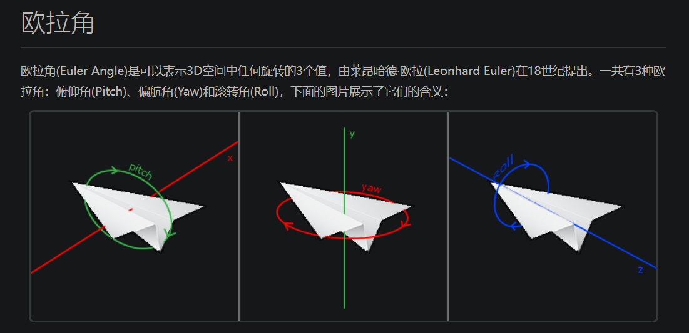
pitch 绕着x轴的 俯仰角 y轴 z滚转角 像开飞机一样