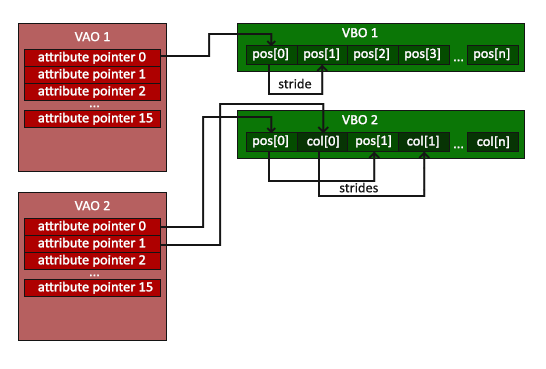
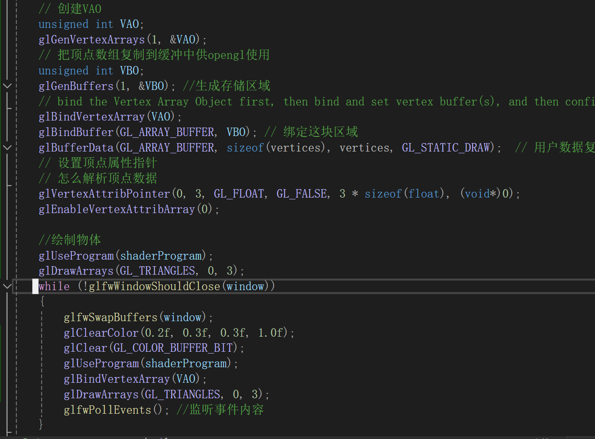
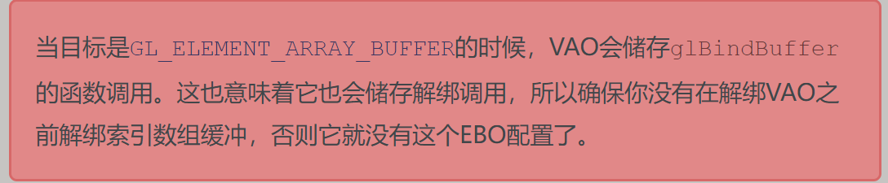

- [opengl](#opengl)
  - [定义](#定义)
  - [上下文](#上下文)
  - [对象](#对象)
    - [顶点着色器](#顶点着色器)
    - [片段着色器](#片段着色器)
    - [着色流程](#着色流程)
      - [顶点流程-顶点着色器](#顶点流程-顶点着色器)
      - [片段着色器](#片段着色器-1)
      - [链接程序](#链接程序)
    - [EBO渲染](#ebo渲染)
  - [原理-图形渲染管线（翻译应该为流程）](#原理-图形渲染管线翻译应该为流程)
- [Glfw](#glfw)
  - [参数](#参数)
    - [glfwWindowHint 给窗口设置属性](#glfwwindowhint-给窗口设置属性)
    - [glfwSetFramebufferSizeCallback](#glfwsetframebuffersizecallback)
    - [glfwPollEvents](#glfwpollevents)
    - [glfwWindowShouldClose](#glfwwindowshouldclose)
    - [glfwSwapBuffers](#glfwswapbuffers)
  - [加载显存地址内容](#加载显存地址内容)
- [问题](#问题)


## opengl
### 定义
是一个接口，具体的方法由显卡厂商提供，函数指针，需要查找显卡实现方法的指针地址才能使用。
类似如下
// 定义函数原型
typedef void (*GL_GENBUFFERS) (GLsizei, GLuint*);
// 找到正确的函数并赋值给函数指针
GL_GENBUFFERS glGenBuffers  = (GL_GENBUFFERS)wglGetProcAddress("glGenBuffers");
// 现在函数可以被正常调用了
GLuint buffer;
glGenBuffers(1, &buffer);

### 上下文
opengl是一个状态机（待补充完整）

### 对象
顶点数组对象 VAO  
```
!!!!!!!!!!!!!! OpenGL的核心模式要求我们使用VAO，所以它知道该如何处理我们的顶点输入。如果我们绑定VAO失败，OpenGL会拒绝绘制任何东西。!!!!!!!!!!!!!!!!!!!!!!!!!!!!!  
```
顶点缓冲对象 VBO  
    可以一次性发送一大批数据到显卡中，CPU把数据发送在GPU比较慢，所以一次性发送多点数据
元素缓冲对象 EBO  
就是减少共同顶点而带过来的额外开销

着色器
图元
#### 顶点着色器
确定渲染的位置
#### 片段着色器
片段着色器(Fragment Shader)是第二个也是最后一个我们打算创建的用于渲染三角形的着色器。片段着色器所做的是计算像素最后的颜色输出。
#### 着色流程
##### 顶点流程-顶点着色器
1、创建顶点坐标 char[]  
绑定VAO先，然后设置VBO顶点缓存数据
	// bind the Vertex Array Object first, then bind and set vertex buffer(s), and then configure vertex attributes(s).
	glBindVertexArray(VAO);

2、生成一块显存的内存区域   VBO获取内容开启这个区域的识别码，类似指针接受。
```
glGenBuffers（1，&VBO)
```
```c
第一个参数作用：你是在请求 OpenGL 生成一个新的缓冲对象，并将这个新缓冲对象的唯一标识符放入变量 `VBO`。之后，你可以使用 `VBO` 来引用这个缓冲对象，比如在绑定缓冲对象、向缓冲对象上传数据等操作中。
如果你需要生成多个缓冲对象，你可以增加第一个参数的值，并提供足够大的数组来存储生成的所有缓冲对象的名称，例如：
GLuint buffers[5];
glGenBuffers(5, buffers);
这将生成 5 个新的缓冲对象，并将它们的标识符存储到 `buffers` 数组中。
``` 
3、绑定 GL_ARRAY_BUFFER 内容到这块区域VBO ，使用glBindBuffer(GL_ARRAY_BUFFER,VBO)
4、将用户数据复制到GL_ARRAY_BUFFER内部 
```
glBufferData(GL_ARRAY_BUFFER, sizeof(vertices), vertices, GL_STATIC_DRAW);

GL_STATIC_DRAW ：数据不会或几乎不会改变。
GL_DYNAMIC_DRAW：数据会被改变很多。
GL_STREAM_DRAW ：数据每次绘制时都会改变。
```
5、设置顶点着色器代码
着色器是将用户定义的顶点输入进去，所以以'in'接受
```
const char* vertexShaderSource = "#version 330 core\n"
"layout (location=0) in vec3 aPos;\n"
"void main()\n"
"{\n"
"	gl_Position=vec4(a.Pos.x,aPos.y,aPos.z,1.0);\n"
"}\0";
```
创建着色器变量接受
```
unsigned int vertexShader;
vertexShader = glCreateShader(GL_VERTEX_SHADER);
```

附着着色器，然后编译
glShaderSource(vertexShader,1,&vertexShaderSouece,NULL);
glCompileShader(vertexShader);
```
glShaderSource函数把要编译的着色器对象作为第一个参数。第二参数指定了传递的源码字符串数量，这里只有一个。第三个参数是顶点着色器真正的源码，第四个参数我们先设置为NULL。
```
然后在检查是否编译成功
##### 片段着色器
就是像素的颜色值
```
#version 330 core
out vec4 FragColor;
void main()
{
    FragColor = vec4(1.0f,0.5f,0.2f,1.0f);
}
```
unsigned int fragmentShader;
fragmentShader = glCreateShader(GL_FRAGMENT_SHADER);
glShaderSource(fragmentShader, 1, &fragmentShaderSource, NULL);
glCompileShader(fragmentShader);


##### 链接程序
1、创建程序对象
```
unsigned int shaderProgram;
shaderProgram = glCreateProgram();
```
2、链接两个着色器
```
glAttachShader(shaderProgram,vertexShader);
glAttachShader(shaderProgram,fragmentShader);
glLinkProgram(shaderProgram);
```
3、判断是否链接成功
```
glGetProgramiv(shaderProgram, GL_LINK_STATUS, &success);
if(!success) {
    glGetProgramInfoLog(shaderProgram, 512, NULL, infoLog);
    ...
}
```
4、使用并且删除
glUseProgram(shaderProgram);
glDeleteShader(vertexShader);
glDeleteShader(fragmentShader);

至此我们已经将顶点数据发送，以及怎么着色器处理，但是opengl还不知道怎么释放内存中的数据，以及数据怎么链接到顶点着色器上
glVertexAttribPointer(0,3,GL_FLOAT,GL_FALSE,3*sizeof(float),(void*)0);
glEnableVertexAttribArray(0);

```
glVertexAttribPointer函数的参数非常多，所以我会逐一介绍它们：

第一个参数指定我们要配置的顶点属性。还记得我们在顶点着色器中使用layout(location = 0)定义了position顶点属性的位置值(Location)吗？它可以把顶点属性的位置值设置为0。因为我们希望把数据传递到这一个顶点属性中，所以这里我们传入0。
第二个参数指定顶点属性的大小。顶点属性是一个vec3，它由3个值组成，所以大小是3。
第三个参数指定数据的类型，这里是GL_FLOAT(GLSL中vec*都是由浮点数值组成的)。
下个参数定义我们是否希望数据被标准化(Normalize)。如果我们设置为GL_TRUE，所有数据都会被映射到0（对于有符号型signed数据是-1）到1之间。我们把它设置为GL_FALSE。
第五个参数叫做步长(Stride)，它告诉我们在连续的顶点属性组之间的间隔。由于下个组位置数据在3个float之后，我们把步长设置为3 * sizeof(float)。要注意的是由于我们知道这个数组是紧密排列的（在两个顶点属性之间没有空隙）我们也可以设置为0来让OpenGL决定具体步长是多少（只有当数值是紧密排列时才可用）。一旦我们有更多的顶点属性，我们就必须更小心地定义每个顶点属性之间的间隔，我们在后面会看到更多的例子（译注: 这个参数的意思简单说就是从这个属性第二次出现的地方到整个数组0位置之间有多少字节）。
最后一个参数的类型是void*，所以需要我们进行这个奇怪的强制类型转换。它表示位置数据在缓冲中起始位置的偏移量(Offset)。由于位置数据在数组的开头，所以这里是0。我们会在后面详细解释这个参数。
```

- `index`：指定要启用的顶点数组的索引。
当你调用 `glEnableVertexAttribArray(0);` 时，你正在启用索引为 0 的顶点属性。在着色器中，通常通过 layout 限定符来指定每个 attribute 变量的位置索引


结束后可以解绑此VAO
给其他VAO调用
    // You can unbind the VAO afterwards so other VAO calls won't accidentally modify this VAO, but this rarely happens. Modifying other
    // VAOs requires a call to glBindVertexArray anyways so we generally don't unbind VAOs (nor VBOs) when it's not directly necessary.
    glBindVertexArray(0); 


编译着色器，创建VAO，然后将顶点数据填充（VBO），然后使用着色器绘制，loop渲染



#### EBO渲染

```
	unsigned int EBO;
	glGenBuffers(1, &EBO);
	glBindBuffer(GL_ELEMENT_ARRAY_BUFFER, EBO);
	// 复制数据
	glBufferData(GL_ELEMENT_ARRAY_BUFFER, size(indices), indices, GL_STATIC_DRAW);

	glDrawElements(GL_TRIANGLES,6,GL_UNSIGNALED,0)
```
```
glDrawElements 函数
第一个参数指定了我们绘制的模式，这个和glDrawArrays的一样。第二个参数是我们打算绘制顶点的个数，这里填6，也就是说我们一共需要绘制6个顶点。第三个参数是索引的类型，这里是GL_UNSIGNED_INT。最后一个参数里我们可以指定EBO中的偏移量（或者传递一个索引数组，但是这是当你不在使用索引缓冲对象的时候），但是我们会在这里填写0。
```
注意项：  


流程生成VAO--绑定VAO--生成VBO赋予顶点数据--绑定定义赐予复制数据--生成EBO--绑定定义赋予共用点的index，然后使用着色器然后需然后 element
### 原理-图形渲染管线（翻译应该为流程）
opengl是3D控件，屏幕显示是2D，3D转2D就是通过opengl图形渲染管线


## Glfw
opengl轻量工具集，绘制管理gl窗口上下文 ，提供键盘手柄鼠标输入设备

### 参数
#### glfwWindowHint 给窗口设置属性  
    glfwWindowHint(GLFW_OPENGL_FORWARD_COMPAT, GL_TRUE); 兼容macos
glfwInit 初始化

#### glfwSetFramebufferSizeCallback
告诉glfw每次调整窗口使用这个回调函数

#### glfwPollEvents
接受事件（鼠标键盘等）
#### glfwWindowShouldClose
函数在我们每次循环的开始前检查一次GLFW是否被要求退出，如果是的话，该函数返回true，渲染循环将停止运行，之后我们就可以关闭应用程序glfw

#### glfwSwapBuffers
函数会交换颜色缓冲（它是一个储存着GLFW窗口每一个像素颜色值的大缓冲），它在这一迭代中被用来绘制，并且将会作为输出显示在屏幕上。
### 加载显存地址内容

## 问题
