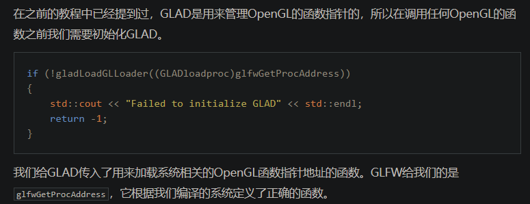
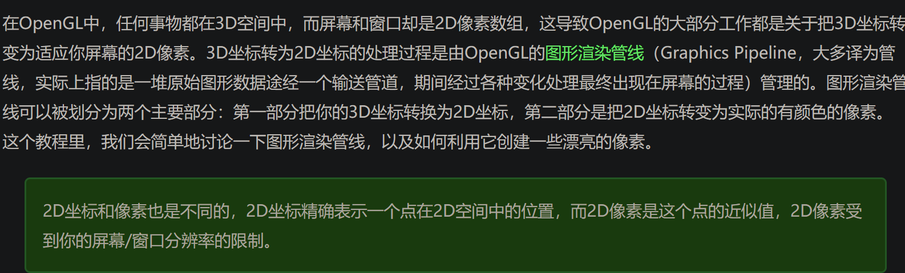

## opengl
### 定义
是一个接口，具体的方法由显卡厂商提供，函数指针，需要查找显卡实现方法的指针地址才能使用。
类似如下
// 定义函数原型
typedef void (*GL_GENBUFFERS) (GLsizei, GLuint*);
// 找到正确的函数并赋值给函数指针
GL_GENBUFFERS glGenBuffers  = (GL_GENBUFFERS)wglGetProcAddress("glGenBuffers");
// 现在函数可以被正常调用了
GLuint buffer;
glGenBuffers(1, &buffer);

### 上下文
opengl是一个状态机（待补充完整）

## Glfw
opengl轻量工具集，绘制管理gl窗口上下文 ，提供键盘手柄鼠标输入设备

### 参数
#### glfwWindowHint 给窗口设置属性  
    glfwWindowHint(GLFW_OPENGL_FORWARD_COMPAT, GL_TRUE); 兼容macos
glfwInit 初始化

#### glfwSetFramebufferSizeCallback
告诉glfw每次调整窗口使用这个回调函数

#### glfwPollEvents
接受事件（鼠标键盘等）
#### glfwWindowShouldClose
函数在我们每次循环的开始前检查一次GLFW是否被要求退出，如果是的话，该函数返回true，渲染循环将停止运行，之后我们就可以关闭应用程序glfw

#### glfwSwapBuffers
函数会交换颜色缓冲（它是一个储存着GLFW窗口每一个像素颜色值的大缓冲），它在这一迭代中被用来绘制，并且将会作为输出显示在屏幕上。
### 加载显存地址内容
o

### 对象
顶点数组对象 VAO  
顶点缓冲对象 VBO  
元素缓冲对象 EBO  

着色器

### 原理-图形渲染管线
opengl是3D控件，屏幕显示是2D，3D转2D就是通过opengl图形渲染管线

